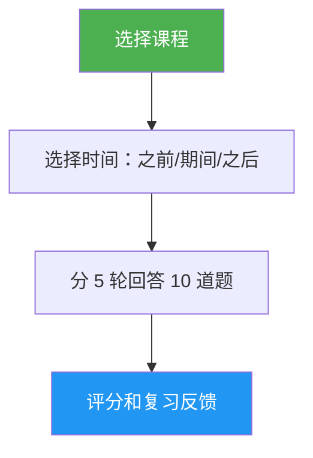

# 课程测验

> 交互式测验，针对特定 Claude Code 课程进行 10 道题目的测试，提供逐题反馈和针对性的复习指导。

## 亮点

- 每课 10 道题目，混合概念理解和实践应用
- 覆盖全部 10 课（01-Slash Commands 到 10-CLI）
- 三种时间模式：预测试、进度检查或掌握验证
- 逐题反馈，包含正确答案和解释
- 针对性复习建议，指向课程的具体章节
- 100 道题库分布在所有课程中，位于 `references/question-bank.md`

## 使用时机

| 这样说… | Skill 将会… |
|---|---|
| "quiz me on hooks" | 运行第 06 课 Hooks 的 10 道题测验 |
| "lesson quiz 03" | 测试你对第 03 课 Skills 的知识 |
| "do I understand MCP" | 评估你对第 05 课 MCP 的理解 |
| "practice quiz" | 让你选择一课，然后进行测验 |

## 工作原理



## 用法

```
/lesson-quiz [课程名称或编号]
```

示例：
```
/lesson-quiz hooks
/lesson-quiz 03
/lesson-quiz advanced-features
/lesson-quiz           # （提示选择课程）
```

## 输出

### 得分报告
- 10 分制总分及等级（精通 / 熟练 / 发展中 / 入门）
- 按题目类别（概念 vs. 实践）细分

### 逐题反馈
对于每道错误答案：
- 你的答案与正确答案对比
- 正确答案正确的原因说明
- 需要复习的具体课程章节

### 时间感知指导
- **之前**：建立基线，突出学习时需要关注的领域
- **期间**：识别你已掌握的内容和需要回顾的部分
- **之后**：确认掌握程度或定位剩余的知识缺口

## 资源

| 路径 | 描述 |
|---|---|
| `references/question-bank.md` | 100 道预编写题目（每课 10 道），包含答案、解释和复习指引 |
