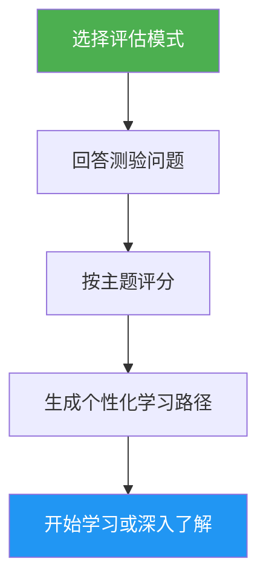

# 自我评估与学习路径顾问

> 全面的 Claude Code 能力评估，评测 10 个功能领域，识别技能缺口，并生成个性化学习路径助你提升。

## 亮点

- 两种评估模式：快速评估（8 题，约 2 分钟）和深度评估（5 轮，约 5 分钟）
- 评测 10 个功能领域：Slash Commands、Memory、Skills、Hooks、MCP、Subagents、Checkpoints、Advanced Features、Plugins、CLI
- 按主题评分，包含掌握等级（无 / 基础 / 熟练）
- 缺口分析，支持依赖感知的优先级排序
- 个性化学习路径，包含具体练习和成功标准
- 后续操作：开始学习、深入了解、实践项目或重新测评

## 使用时机

| 这样说… | Skill 将会… |
|---|---|
| "assess my level" | 运行评估测验并确定你的水平 |
| "where should I start" | 评估你的经验并建议起点 |
| "check my skills" | 生成覆盖所有 10 个领域的详细技能档案 |
| "what should I learn next" | 识别缺口并构建优先学习路径 |

## 工作原理



## 评估模式

### 快速评估（约 2 分钟）
- 分 2 轮的 8 道是/否经验题
- 确定整体水平：初级 / 中级 / 高级
- 列出具体缺口及教程链接
- 适用于：首次使用者、快速检查

### 深度评估（约 5 分钟）
- 5 轮问题覆盖 10 个功能领域（每轮 2 个主题）
- 按主题评分（每项 0-2 分，总分 20 分）
- 掌握表包含优势领域、优先缺口和复习项目
- 依赖感知的学习路径，包含阶段和时间估计
- 推荐的实践项目，结合缺口主题
- 适用于：希望提升的有经验用户、定期技能回顾

## 用法

```
/self-assessment
```

## 输出

### 技能档案表
显示每个主题的得分、掌握等级和状态（学习 / 复习 / 已掌握）。

### 个性化学习路径
- 按依赖顺序组织为阶段
- 每个主题包含：教程链接、重点领域、关键练习、成功标准
- 时间估计根据已掌握主题进行调整
- 结合多个缺口领域的实践项目

### 后续操作
查看结果后，选择：
- 从指导练习开始第一个缺口教程
- 深入了解某个具体缺口领域
- 设置覆盖你缺口的实践项目
- 以不同评估模式重新测评
