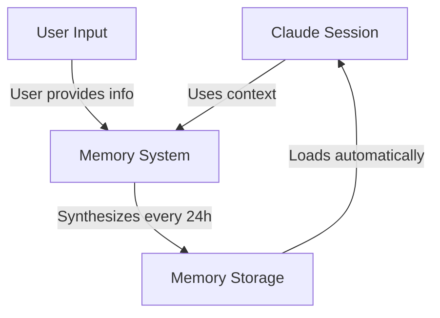
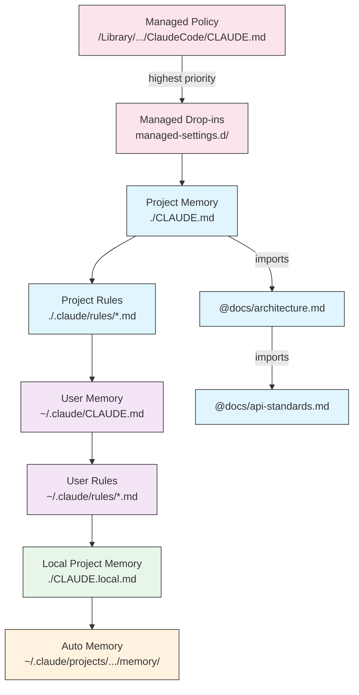
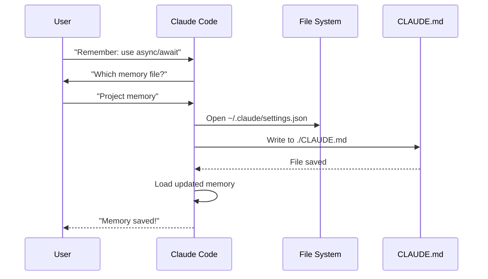
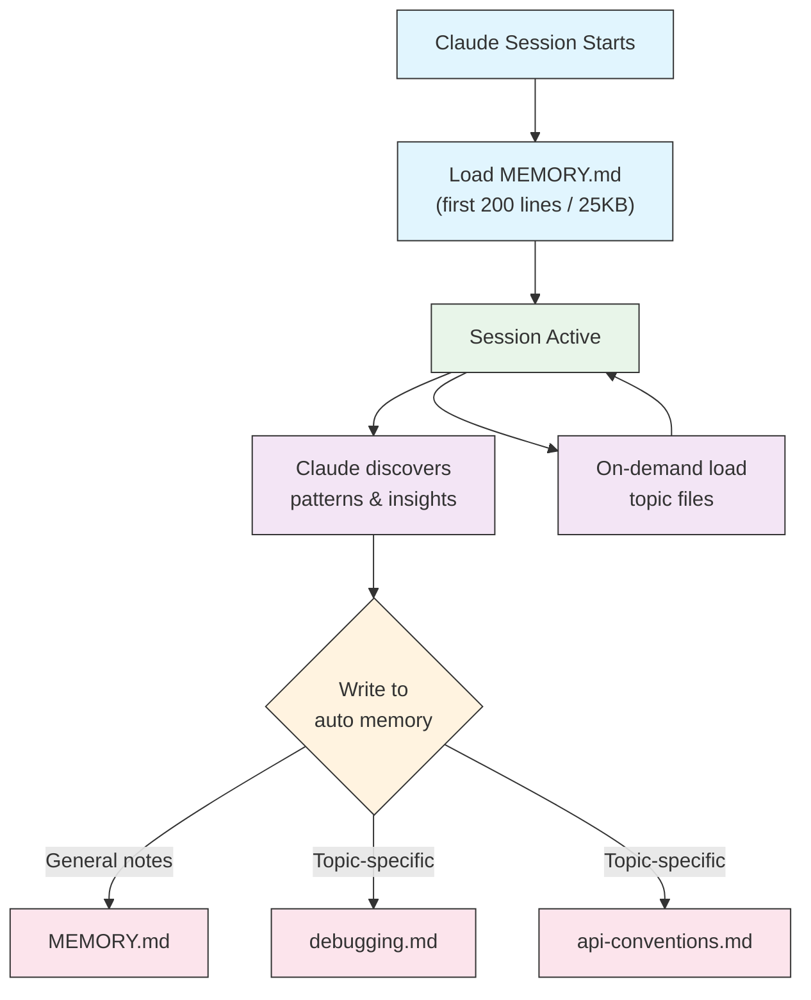

<picture>
  <source media="(prefers-color-scheme: dark)" srcset="../resources/logos/claude-howto-logo-dark.svg">
  
</picture>

# 记忆指南

记忆使 Claude 能够在不同会话和对话之间保留上下文。它有两种形式：claude.ai 中的自动综合，以及 Claude Code 中基于文件系统的 CLAUDE.md。

## 概述

Claude Code 中的记忆提供跨多个会话和对话的持久上下文。与临时上下文窗口不同，记忆文件允许你：

- 在团队间共享项目标准
- 存储个人开发偏好
- 维护特定目录的规则和配置
- 导入外部文档
- 将记忆作为项目的一部分进行版本控制

记忆系统在多个层级运作，从全局个人偏好到特定子目录，允许对 Claude 记住什么以及如何应用这些知识进行精细控制。

## 记忆命令快速参考

| 命令 | 用途 | 用法 | 使用时机 |
|---------|---------|-------|-------------|
| `/init` | 初始化项目记忆 | `/init` | 启动新项目，首次设置 CLAUDE.md |
| `/memory` | 在编辑器中编辑记忆文件 | `/memory` | 大量更新、重组、审查内容 |
| `#` 前缀 | ~~快速单行添加记忆~~ **已停用** | — | 改用 `/memory` 或以对话方式请求 |
| `@path/to/file` | 导入外部内容 | `@README.md` 或 `@docs/api.md` | 在 CLAUDE.md 中引用现有文档 |

## 快速入门：初始化记忆

### `/init` 命令

`/init` 命令是在 Claude Code 中设置项目记忆的最快方式。它会初始化一个包含基础项目文档的 CLAUDE.md 文件。

**用法：**

```bash
/init
```

**功能说明：**

- 在项目中创建新的 CLAUDE.md 文件（通常位于 `./CLAUDE.md` 或 `./.claude/CLAUDE.md`）
- 建立项目约定和指南
- 为跨会话的上下文持久化奠定基础
- 提供用于记录项目标准的模板结构

**增强交互模式：** 设置 `CLAUDE_CODE_NEW_INIT=1` 以启用多阶段交互流程，逐步引导你完成项目设置：

```bash
CLAUDE_CODE_NEW_INIT=1 claude
/init
```

**何时使用 `/init`：**

- 使用 Claude Code 开始新项目时
- 建立团队编码标准和约定时
- 创建关于代码库结构的文档时
- 为协作开发设置记忆层级时

**示例工作流程：**

```markdown
# In your project directory
/init

# Claude creates CLAUDE.md with structure like:
# Project Configuration
## Project Overview
- Name: Your Project
- Tech Stack: [Your technologies]
- Team Size: [Number of developers]

## Development Standards
- Code style preferences
- Testing requirements
- Git workflow conventions
```

### 快速记忆更新

> **注意**：内联记忆的 `#` 快捷方式已停用。请使用 `/memory` 直接编辑记忆文件，或以对话方式要求 Claude 记住某些内容（例如，"记住我们在这个项目中始终使用 TypeScript 严格模式"）。

推荐的向记忆中添加信息的方式有：

**方式 1：使用 `/memory` 命令**

```bash
/memory
```

在系统编辑器中打开记忆文件进行直接编辑。

**方式 2：以对话方式请求**

```
Remember that we always use TypeScript strict mode in this project.
Please add to memory: prefer async/await over promise chains.
```

Claude 会根据你的请求更新相应的 CLAUDE.md 文件。

**历史参考**（已不再有效）：

`#` 前缀快捷方式此前允许内联添加规则：

```markdown
# Always use TypeScript strict mode in this project  ← no longer works
```

如果你之前依赖此模式，请改用 `/memory` 命令或对话方式请求。

### `/memory` 命令

`/memory` 命令提供在 Claude Code 会话中直接编辑 CLAUDE.md 记忆文件的功能。它会在系统编辑器中打开记忆文件，便于全面编辑。

**用法：**

```bash
/memory
```

**功能说明：**

- 在系统默认编辑器中打开记忆文件
- 允许进行大量添加、修改和重组
- 提供对层级中所有记忆文件的直接访问
- 支持跨会话管理持久上下文

**何时使用 `/memory`：**

- 审查现有记忆内容
- 对项目标准进行大量更新
- 重组记忆结构
- 添加详细的文档或指南
- 随着项目发展维护和更新记忆

**`/memory` 与 `/init` 的对比**

| 方面 | `/memory` | `/init` |
|--------|-----------|---------|
| **用途** | 编辑现有记忆文件 | 初始化新的 CLAUDE.md |
| **使用时机** | 更新/修改项目上下文 | 开始新项目 |
| **操作** | 打开编辑器进行修改 | 生成入门模板 |
| **工作流** | 持续维护 | 一次性设置 |

**示例工作流程：**

```markdown
# Open memory for editing
/memory

# Claude presents options:
# 1. Managed Policy Memory
# 2. Project Memory (./CLAUDE.md)
# 3. User Memory (~/.claude/CLAUDE.md)
# 4. Local Project Memory

# Choose option 2 (Project Memory)
# Your default editor opens with ./CLAUDE.md content

# Make changes, save, and close editor
# Claude automatically reloads the updated memory
```

**使用记忆导入：**

CLAUDE.md 文件支持 `@path/to/file` 语法以包含外部内容：

```markdown
# Project Documentation
See @README.md for project overview
See @package.json for available npm commands
See @docs/architecture.md for system design

# Import from home directory using absolute path
@~/.claude/my-project-instructions.md
```

**导入功能特性：**

- 支持相对路径和绝对路径（例如 `@docs/api.md` 或 `@~/.claude/my-project-instructions.md`）
- 支持递归导入，最大深度为 5
- 首次从外部位置导入时会触发安全审批对话框
- 导入指令在 markdown 代码段或代码块内不会被解析（因此在示例中记录它们是安全的）
- 帮助避免重复，通过引用现有文档实现
- 自动将引用的内容包含在 Claude 的上下文中

## 记忆架构

Claude Code 中的记忆遵循层级系统，不同的作用域服务于不同的目的：



## Claude Code 中的记忆层级

Claude Code 使用多层级的层次化记忆系统。记忆文件在 Claude Code 启动时自动加载，较高层级的文件具有更高的优先级。

**完整的记忆层级（按优先级排列）：**

1. **托管策略** - 组织范围的指令
   - macOS: `/Library/Application Support/ClaudeCode/CLAUDE.md`
   - Linux/WSL: `/etc/claude-code/CLAUDE.md`
   - Windows: `C:\Program Files\ClaudeCode\CLAUDE.md`

2. **托管插入式文件** - 按字母顺序合并的策略文件（v2.1.83+）
   - 位于托管策略 CLAUDE.md 旁边的 `managed-settings.d/` 目录
   - 文件按字母顺序合并，支持模块化策略管理

3. **项目记忆** - 团队共享的上下文（版本控制）
   - `./.claude/CLAUDE.md` 或 `./CLAUDE.md`（在仓库根目录）

4. **项目规则** - 模块化、按主题划分的项目指令
   - `./.claude/rules/*.md`

5. **用户记忆** - 个人偏好（所有项目）
   - `~/.claude/CLAUDE.md`

6. **用户级规则** - 个人规则（所有项目）
   - `~/.claude/rules/*.md`

7. **本地项目记忆** - 个人的项目特定偏好
   - `./CLAUDE.local.md`

> **注意**：`CLAUDE.local.md` 已获得完整支持，并记录在[官方文档](https://code.claude.com/docs/en/memory)中。它提供不提交到版本控制的个人项目特定偏好。请将 `CLAUDE.local.md` 添加到你的 `.gitignore` 中。

8. **自动记忆** - Claude 的自动笔记和学习成果
   - `~/.claude/projects/<project>/memory/`

**记忆发现行为：**

Claude 按此顺序搜索记忆文件，靠前的位置具有更高的优先级：



## 使用 `claudeMdExcludes` 排除 CLAUDE.md 文件

在大型单仓库中，某些 CLAUDE.md 文件可能与你当前的工作无关。`claudeMdExcludes` 设置允许你跳过特定的 CLAUDE.md 文件，使其不被加载到上下文中：

```jsonc
// In ~/.claude/settings.json or .claude/settings.json
{
  "claudeMdExcludes": [
    "packages/legacy-app/CLAUDE.md",
    "vendors/**/CLAUDE.md"
  ]
}
```

模式相对于项目根目录的路径进行匹配。这在以下场景特别有用：

- 包含多个子项目的单仓库，其中仅部分与当前工作相关
- 包含第三方或供应商提供的 CLAUDE.md 文件的仓库
- 通过排除过时或不相关的指令来减少 Claude 上下文窗口中的噪音

## 设置文件层级

Claude Code 的设置（包括 `autoMemoryDirectory`、`claudeMdExcludes` 和其他配置）从五级层次结构中解析，较高层级具有更高的优先级：

| 层级 | 位置 | 作用域 |
|-------|----------|-------|
| 1（最高） | 托管策略（系统级） | 组织范围强制执行 |
| 2 | `managed-settings.d/`（v2.1.83+） | 模块化策略插入式文件，按字母顺序合并 |
| 3 | `~/.claude/settings.json` | 用户偏好 |
| 4 | `.claude/settings.json` | 项目级（提交到 git） |
| 5（最低） | `.claude/settings.local.json` | 本地覆盖（被 git 忽略） |

**平台特定配置（v2.1.51+）：**

设置还可以通过以下方式配置：
- **macOS**：属性列表（plist）文件
- **Windows**：Windows 注册表

这些平台原生机制与 JSON 设置文件同时读取，并遵循相同的优先级规则。

> **注意（v2.1.119）**：`/config` 的更改现在会持久化到 `~/.claude/settings.json`。通过 `/config` 写入的值参与上述正常的项目/本地/策略优先级链——它们不再仅限于会话。使用 `/config` 进行交互式编辑，直接编辑 `settings.json` 文件进行脚本化或托管配置。

### 保留和清理设置

| 设置 | 类型 | 默认值 | 描述 |
|---------|------|---------|-------------|
| `cleanupPeriodDays` | 整数（天） | 30 | 磁盘上工件的保留窗口。**自 v2.1.117 起**，适用于以下所有四项：检查点（`~/.claude/checkpoints/`）、任务（`~/.claude/tasks/`）、shell 快照（`~/.claude/shell-snapshots/`）和备份（`~/.claude/backups/`）。超过保留窗口的文件在启动时被清理。 |

```jsonc
// ~/.claude/settings.json
{
  "cleanupPeriodDays": 14
}
```

### 署名、语音和 PR URL 设置

| 设置 | 类型 | 描述 |
|---------|------|-------------|
| `attribution.commit` | 布尔值 | 在 Claude 创建的提交中添加 `Co-Authored-By: Claude` 尾注。替代已弃用的 `includeCoAuthoredBy` 标志。 |
| `attribution.pr` | 布尔值 | 在拉取请求描述中添加 Claude 署名。替代已弃用的用于 PR 的 `includeCoAuthoredBy` 标志。 |
| `voice.enabled` | 布尔值 | 启用按键说话语音输入（`/voice`）。替代已弃用的 `voiceEnabled` 标志。 |
| `prUrlTemplate` | 字符串 | **v2.1.119 新增。** PR 页脚徽章的自定义 URL 模板；适用于 GitLab、Bitbucket 或内部代码审查平台。支持 `{{owner}}`、`{{repo}}` 和 `{{number}}` 占位符。 |

```jsonc
// ~/.claude/settings.json
{
  "attribution": {
    "commit": false,
    "pr": true
  },
  "voice": {
    "enabled": true
  },
  "prUrlTemplate": "https://gitlab.internal/{{owner}}/{{repo}}/-/merge_requests/{{number}}"
}
```

#### 已弃用的设置名称

以下旧版设置键仍然有效但已弃用。请优先使用上述替代项。

| 已弃用的键 | 替代项 | 说明 |
|----------------|-------------|-------|
| `includeCoAuthoredBy` | `attribution.commit` / `attribution.pr` | 旧的单一标志被拆分为单独的提交和 PR 开关。使用旧版安装的用户可以保留旧键；新项目应使用嵌套形式。 |
| `voiceEnabled` | `voice.enabled` | 归入 `voice` 命名空间，与未来的语音相关选项放在一起。 |

## 模块化规则系统

使用 `.claude/rules/` 目录结构创建有组织的、路径特定的规则。规则可以在项目级和用户级定义：

```
your-project/
├── .claude/
│   ├── CLAUDE.md
│   └── rules/
│       ├── code-style.md
│       ├── testing.md
│       ├── security.md
│       └── api/                  # Subdirectories supported
│           ├── conventions.md
│           └── validation.md

~/.claude/
├── CLAUDE.md
└── rules/                        # User-level rules (all projects)
    ├── personal-style.md
    └── preferred-patterns.md
```

规则在 `rules/` 目录中递归发现，包括任何子目录。`~/.claude/rules/` 中的用户级规则在项目级规则之前加载，允许项目覆盖个人默认值。

### 使用 YAML Frontmatter 的路径特定规则

定义仅适用于特定文件路径的规则：

```markdown
---
paths: src/api/**/*.ts
---

# API Development Rules

- All API endpoints must include input validation
- Use Zod for schema validation
- Document all parameters and response types
- Include error handling for all operations
```

**Glob 模式示例：**

- `**/*.ts` - 所有 TypeScript 文件
- `src/**/*` - src/ 下的所有文件
- `src/**/*.{ts,tsx}` - 多种扩展名
- `{src,lib}/**/*.ts, tests/**/*.test.ts` - 多种模式

### 子目录和符号链接

`.claude/rules/` 中的规则支持两种组织功能：

- **子目录**：规则递归发现，因此你可以将它们组织到基于主题的文件夹中（例如 `rules/api/`、`rules/testing/`、`rules/security/`）
- **符号链接**：支持符号链接以在多个项目间共享规则。例如，你可以将共享规则文件从中央位置符号链接到每个项目的 `.claude/rules/` 目录

## 记忆位置表

| 位置 | 作用域 | 优先级 | 共享范围 | 访问方式 | 最适用于 |
|----------|-------|----------|--------|--------|----------|
| `/Library/Application Support/ClaudeCode/CLAUDE.md` (macOS) | 托管策略 | 1（最高） | 组织 | 系统 | 公司范围的策略 |
| `/etc/claude-code/CLAUDE.md` (Linux/WSL) | 托管策略 | 1（最高） | 组织 | 系统 | 组织标准 |
| `C:\Program Files\ClaudeCode\CLAUDE.md` (Windows) | 托管策略 | 1（最高） | 组织 | 系统 | 企业指南 |
| `managed-settings.d/*.md`（与策略同级） | 托管插入式文件 | 1.5 | 组织 | 系统 | 模块化策略文件（v2.1.83+） |
| `./CLAUDE.md` 或 `./.claude/CLAUDE.md` | 项目记忆 | 2 | 团队 | Git | 团队标准、共享架构 |
| `./.claude/rules/*.md` | 项目规则 | 3 | 团队 | Git | 路径特定的模块化规则 |
| `~/.claude/CLAUDE.md` | 用户记忆 | 4 | 个人 | 文件系统 | 个人偏好（所有项目） |
| `~/.claude/rules/*.md` | 用户规则 | 5 | 个人 | 文件系统 | 个人规则（所有项目） |
| `./CLAUDE.local.md` | 项目本地 | 6 | 个人 | Git（忽略） | 个人的项目特定偏好 |
| `~/.claude/projects/<project>/memory/` | 自动记忆 | 7（最低） | 个人 | 文件系统 | Claude 的自动笔记和学习成果 |

## 记忆更新生命周期

以下是记忆更新在 Claude Code 会话中的流转方式：



## 自动记忆

自动记忆是一个持久化目录，Claude 在与你的项目协作过程中自动记录学习成果、模式和洞察。与你手动编写和维护的 CLAUDE.md 文件不同，自动记忆是 Claude 自己在会话期间写入的。

### 自动记忆的工作原理

- **位置**：`~/.claude/projects/<project>/memory/`
- **入口文件**：`MEMORY.md` 作为自动记忆目录中的主文件
- **主题文件**：可选的附加文件，用于特定主题（例如 `debugging.md`、`api-conventions.md`）
- **加载行为**：`MEMORY.md` 的前 200 行（或前 25KB，以先到者为准）在会话开始时加载到上下文中。主题文件按需加载，不会在启动时加载。
- **读写**：Claude 在会话期间发现模式和项目特定知识时读取和写入记忆文件

### 自动记忆架构



### 自动记忆目录结构

```
~/.claude/projects/<project>/memory/
├── MEMORY.md              # Entrypoint (first 200 lines / 25KB loaded at startup)
├── debugging.md           # Topic file (loaded on demand)
├── api-conventions.md     # Topic file (loaded on demand)
└── testing-patterns.md    # Topic file (loaded on demand)
```

### 版本要求

自动记忆需要 **Claude Code v2.1.59 或更高版本**。如果你使用的是旧版本，请先升级：

```bash
npm install -g @anthropic-ai/claude-code@latest
```

### 自定义自动记忆目录

默认情况下，自动记忆存储在 `~/.claude/projects/<project>/memory/`。你可以使用 `autoMemoryDirectory` 设置更改此位置（自 **v2.1.74** 起可用）：

```jsonc
// In ~/.claude/settings.json or .claude/settings.local.json (user/local settings only)
{
  "autoMemoryDirectory": "/path/to/custom/memory/directory"
}
```

> **注意**：`autoMemoryDirectory` 只能在用户级（`~/.claude/settings.json`）或本地设置（`.claude/settings.local.json`）中设置，不能在项目或托管策略设置中设置。

这在以下场景很有用：

- 将自动记忆存储在共享或同步的位置
- 将自动记忆与默认的 Claude 配置目录分开
- 在默认层级之外使用项目特定路径

### 工作树和仓库共享

同一 git 仓库内的所有工作树和子目录共享单个自动记忆目录。这意味着在工作树之间切换或在同一仓库的不同子目录中工作时，将读取和写入相同的记忆文件。

### 子代理记忆

子代理（通过 Task 或并行执行等工具生成）可以拥有自己的记忆上下文。在子代理定义中使用 `memory` frontmatter 字段来指定要加载的记忆作用域：

```yaml
memory: user      # Load user-level memory only
memory: project   # Load project-level memory only
memory: local     # Load local memory only
```

这允许子代理使用聚焦的上下文运行，而不是继承完整的记忆层级。

> **注意**：子代理也可以维护自己的自动记忆。详情请参阅[官方子代理记忆文档](https://code.claude.com/docs/en/sub-agents#enable-persistent-memory)。

### 控制自动记忆

自动记忆可以通过 `CLAUDE_CODE_DISABLE_AUTO_MEMORY` 环境变量进行控制：

| 值 | 行为 |
|-------|----------|
| `0` | 强制**开启**自动记忆 |
| `1` | 强制**关闭**自动记忆 |
| *（未设置）* | 默认行为（自动记忆已启用） |

```bash
# Disable auto memory for a session
CLAUDE_CODE_DISABLE_AUTO_MEMORY=1 claude

# Force auto memory on explicitly
CLAUDE_CODE_DISABLE_AUTO_MEMORY=0 claude
```

## 使用 `--add-dir` 添加额外目录

`--add-dir` 标志允许 Claude Code 从当前工作目录以外的额外目录加载 CLAUDE.md 文件。这对于单仓库或多项目设置非常有用，因为来自其他目录的上下文可能是相关的。

要启用此功能，请设置环境变量：

```bash
CLAUDE_CODE_ADDITIONAL_DIRECTORIES_CLAUDE_MD=1
```

然后使用该标志启动 Claude Code：

```bash
claude --add-dir /path/to/other/project
```

Claude 将从指定的额外目录加载 CLAUDE.md，同时加载当前工作目录中的记忆文件。

## 实践示例

### 示例 1：项目记忆结构

**文件：** `./CLAUDE.md`

```markdown
# Project Configuration

## Project Overview
- **Name**: E-commerce Platform
- **Tech Stack**: Node.js, PostgreSQL, React 18, Docker
- **Team Size**: 5 developers
- **Deadline**: Q4 2025

## Architecture
@docs/architecture.md
@docs/api-standards.md
@docs/database-schema.md

## Development Standards

### Code Style
- Use Prettier for formatting
- Use ESLint with airbnb config
- Maximum line length: 100 characters
- Use 2-space indentation

### Naming Conventions
- **Files**: kebab-case (user-controller.js)
- **Classes**: PascalCase (UserService)
- **Functions/Variables**: camelCase (getUserById)
- **Constants**: UPPER_SNAKE_CASE (API_BASE_URL)
- **Database Tables**: snake_case (user_accounts)

### Git Workflow
- Branch names: `feature/description` or `fix/description`
- Commit messages: Follow conventional commits
- PR required before merge
- All CI/CD checks must pass
- Minimum 1 approval required

### Testing Requirements
- Minimum 80% code coverage
- All critical paths must have tests
- Use Jest for unit tests
- Use Cypress for E2E tests
- Test filenames: `*.test.ts` or `*.spec.ts`

### API Standards
- RESTful endpoints only
- JSON request/response
- Use HTTP status codes correctly
- Version API endpoints: `/api/v1/`
- Document all endpoints with examples

### Database
- Use migrations for schema changes
- Never hardcode credentials
- Use connection pooling
- Enable query logging in development
- Regular backups required

### Deployment
- Docker-based deployment
- Kubernetes orchestration
- Blue-green deployment strategy
- Automatic rollback on failure
- Database migrations run before deploy

## Common Commands

| Command | Purpose |
|---------|---------|
| `npm run dev` | Start development server |
| `npm test` | Run test suite |
| `npm run lint` | Check code style |
| `npm run build` | Build for production |
| `npm run migrate` | Run database migrations |

## Team Contacts
- Tech Lead: Sarah Chen (@sarah.chen)
- Product Manager: Mike Johnson (@mike.j)
- DevOps: Alex Kim (@alex.k)

## Known Issues & Workarounds
- PostgreSQL connection pooling limited to 20 during peak hours
- Workaround: Implement query queuing
- Safari 14 compatibility issues with async generators
- Workaround: Use Babel transpiler

## Related Projects
- Analytics Dashboard: `/projects/analytics`
- Mobile App: `/projects/mobile`
- Admin Panel: `/projects/admin`
```

### 示例 2：目录特定记忆

**文件：** `./src/api/CLAUDE.md`

````markdown
# API Module Standards

This file overrides root CLAUDE.md for everything in /src/api/

## API-Specific Standards

### Request Validation
- Use Zod for schema validation
- Always validate input
- Return 400 with validation errors
- Include field-level error details

### Authentication
- All endpoints require JWT token
- Token in Authorization header
- Token expires after 24 hours
- Implement refresh token mechanism

### Response Format

All responses must follow this structure:

```json
{
  "success": true,
  "data": { /* actual data */ },
  "timestamp": "2025-11-06T10:30:00Z",
  "version": "1.0"
}
```

Error responses:
```json
{
  "success": false,
  "error": {
    "code": "VALIDATION_ERROR",
    "message": "User message",
    "details": { /* field errors */ }
  },
  "timestamp": "2025-11-06T10:30:00Z"
}
```

### Pagination
- Use cursor-based pagination (not offset)
- Include `hasMore` boolean
- Limit max page size to 100
- Default page size: 20

### Rate Limiting
- 1000 requests per hour for authenticated users
- 100 requests per hour for public endpoints
- Return 429 when exceeded
- Include retry-after header

### Caching
- Use Redis for session caching
- Cache duration: 5 minutes default
- Invalidate on write operations
- Tag cache keys with resource type
````

### 示例 3：个人记忆

**文件：** `~/.claude/CLAUDE.md`

```markdown
# My Development Preferences

## About Me
- **Experience Level**: 8 years full-stack development
- **Preferred Languages**: TypeScript, Python
- **Communication Style**: Direct, with examples
- **Learning Style**: Visual diagrams with code

## Code Preferences

### Error Handling
I prefer explicit error handling with try-catch blocks and meaningful error messages.
Avoid generic errors. Always log errors for debugging.

### Comments
Use comments for WHY, not WHAT. Code should be self-documenting.
Comments should explain business logic or non-obvious decisions.

### Testing
I prefer TDD (test-driven development).
Write tests first, then implementation.
Focus on behavior, not implementation details.

### Architecture
I prefer modular, loosely-coupled design.
Use dependency injection for testability.
Separate concerns (Controllers, Services, Repositories).

## Debugging Preferences
- Use console.log with prefix: `[DEBUG]`
- Include context: function name, relevant variables
- Use stack traces when available
- Always include timestamps in logs

## Communication
- Explain complex concepts with diagrams
- Show concrete examples before explaining theory
- Include before/after code snippets
- Summarize key points at the end

## Project Organization
I organize my projects as:

   project/
   ├── src/
   │   ├── api/
   │   ├── services/
   │   ├── models/
   │   └── utils/
   ├── tests/
   ├── docs/
   └── docker/

## Tooling
- **IDE**: VS Code with vim keybindings
- **Terminal**: Zsh with Oh-My-Zsh
- **Format**: Prettier (100 char line length)
- **Linter**: ESLint with airbnb config
- **Test Framework**: Jest with React Testing Library
```

_我的测试_
要求 Claude 保存一条新规则


Claude 没有保存规则，因为我在任何地方都没有 `Claude.md` 文件。然后要求 Claude 确认位置。


### 示例 4：会话中更新记忆

你可以在活跃的 Claude Code 会话中向记忆添加新规则。有两种方式：

#### 方法 1：直接请求

```markdown
User: Remember that I prefer using React hooks instead of class components
     for all new components.

Claude: I'm adding that to your memory. Which memory file should this go in?
        1. Project memory (./CLAUDE.md)
        2. Personal memory (~/.claude/CLAUDE.md)

User: Project memory

Claude: ✅ Memory saved!

Added to ./CLAUDE.md:
---

### Component Development
- Use functional components with React Hooks
- Prefer hooks over class components
- Custom hooks for reusable logic
- Use useCallback for event handlers
- Use useMemo for expensive computations
```

#### 方法 2：使用"# new rule into memory"模式

你也可以使用显式的"# new rule into memory"模式来触发记忆更新：

```markdown
User: # new rule into memory
      Always validate user input with Zod schemas before processing.

Claude: I'm saving this rule to memory. Which memory file should I use?
        1. Project memory (./CLAUDE.md)
        2. Personal memory (~/.claude/CLAUDE.md)

User: Project memory

Claude: ✅ Memory saved!

Added to ./CLAUDE.md:
---

### Input Validation
- Always validate user input with Zod schemas before processing
- Define schemas at the top of each API handler file
- Return 400 status with validation errors
```

#### 添加记忆的技巧

- 规则要具体且可操作
- 将相关规则归入一个章节标题下
- 更新现有章节而非重复内容
- 选择合适的记忆作用域（项目 vs. 个人）

## 记忆功能对比

| 功能 | Claude Web/Desktop | Claude Code (CLAUDE.md) |
|---------|-------------------|------------------------|
| 自动综合 | ✅ 每 24 小时 | ✅ 自动记忆 |
| 跨项目 | ✅ 共享 | ❌ 项目特定 |
| 团队访问 | ✅ 共享项目 | ✅ Git 追踪 |
| 可搜索 | ✅ 内置 | ✅ 通过 `/memory` |
| 可编辑 | ✅ 在对话中 | ✅ 直接编辑文件 |
| 导入/导出 | ✅ 是 | ✅ 复制/粘贴 |
| 持久性 | ✅ 24 小时以上 | ✅ 无限期 |

### Claude Web/Desktop 中的记忆

#### 记忆综合时间线


**记忆摘要示例：**

```markdown
## Claude's Memory of User

### Professional Background
- Senior full-stack developer with 8 years experience
- Focus on TypeScript/Node.js backends and React frontends
- Active open source contributor
- Interested in AI and machine learning

### Project Context
- Currently building e-commerce platform
- Tech stack: Node.js, PostgreSQL, React 18, Docker
- Working with team of 5 developers
- Using CI/CD and blue-green deployments

### Communication Preferences
- Prefers direct, concise explanations
- Likes visual diagrams and examples
- Appreciates code snippets
- Explains business logic in comments

### Current Goals
- Improve API performance
- Increase test coverage to 90%
- Implement caching strategy
- Document architecture
```

## 最佳实践

### 应做之事 - 应包含的内容

- **具体且详细**：使用清晰详细的指令，而非模糊的指导
  - ✅ 好的做法："所有 JavaScript 文件使用 2 空格缩进"
  - ❌ 避免："遵循最佳实践"

- **保持有序**：使用清晰的 markdown 章节和标题来组织记忆文件

- **使用合适的层级**：
  - **托管策略**：公司范围的策略、安全标准、合规要求
  - **项目记忆**：团队标准、架构、编码约定（提交到 git）
  - **用户记忆**：个人偏好、沟通风格、工具选择
  - **目录记忆**：模块特定的规则和覆盖

- **善用导入**：使用 `@path/to/file` 语法引用现有文档
  - 支持最多 5 层递归嵌套
  - 避免跨记忆文件的重复
  - 示例：`See @README.md for project overview`

- **记录常用命令**：包含你经常使用的命令以节省时间

- **版本控制项目记忆**：将项目级 CLAUDE.md 文件提交到 git 以惠及团队

- **定期审查**：随着项目发展和需求变化定期更新记忆

- **提供具体示例**：包含代码片段和具体场景

### 不应做之事 - 应避免的内容

- **不要存储密钥**：永远不要包含 API 密钥、密码、令牌或凭据

- **不要包含敏感数据**：不要包含个人身份信息、私人信息或专有机密

- **不要重复内容**：使用导入（`@path`）引用现有文档

- **不要模糊**：避免"遵循最佳实践"或"编写好代码"等笼统陈述

- **不要过长**：保持单个记忆文件聚焦且不超过 500 行

- **不要过度组织**：策略性地使用层级；不要创建过多的子目录覆盖

- **不要忘记更新**：过时的记忆可能导致混乱和过时的做法

- **不要超过嵌套限制**：记忆导入最多支持 5 层嵌套

### 记忆管理技巧

**选择合适的记忆层级：**

| 使用场景 | 记忆层级 | 原因 |
|----------|-------------|-----------|
| 公司安全策略 | 托管策略 | 适用于组织范围内的所有项目 |
| 团队代码风格指南 | 项目 | 通过 git 与团队共享 |
| 你偏好的编辑器快捷键 | 用户 | 个人偏好，不共享 |
| API 模块标准 | 目录 | 仅适用于该模块 |

**快速更新工作流程：**

1. 对于单条规则：在对话中使用 `#` 前缀
2. 对于多项更改：使用 `/memory` 打开编辑器
3. 对于初始设置：使用 `/init` 创建模板

**导入最佳实践：**

```markdown
# Good: Reference existing docs
@README.md
@docs/architecture.md
@package.json

# Avoid: Copying content that exists elsewhere
# Instead of copying README content into CLAUDE.md, just import it
```

## 安装说明

### 设置项目记忆

#### 方法 1：使用 `/init` 命令（推荐）

设置项目记忆的最快方式：

1. **导航到你的项目目录：**
   ```bash
   cd /path/to/your/project
   ```

2. **在 Claude Code 中运行 init 命令：**
   ```bash
   /init
   ```

3. **Claude 将创建并填充 CLAUDE.md**，提供模板结构

4. **自定义生成的文件**以匹配你的项目需求

5. **提交到 git：**
   ```bash
   git add CLAUDE.md
   git commit -m "Initialize project memory with /init"
   ```

#### 方法 2：手动创建

如果你偏好手动设置：

1. **在项目根目录创建 CLAUDE.md：**
   ```bash
   cd /path/to/your/project
   touch CLAUDE.md
   ```

2. **添加项目标准：**
   ```bash
   cat > CLAUDE.md << 'EOF'
   # Project Configuration

   ## Project Overview
   - **Name**: Your Project Name
   - **Tech Stack**: List your technologies
   - **Team Size**: Number of developers

   ## Development Standards
   - Your coding standards
   - Naming conventions
   - Testing requirements
   EOF
   ```

3. **提交到 git：**
   ```bash
   git add CLAUDE.md
   git commit -m "Add project memory configuration"
   ```

#### 方法 3：使用 `#` 快速更新

一旦 CLAUDE.md 存在，可在对话中快速添加规则：

```markdown
# Use semantic versioning for all releases

# Always run tests before committing

# Prefer composition over inheritance
```

Claude 会提示你选择要更新的记忆文件。

### 设置个人记忆

1. **创建 ~/.claude 目录：**
   ```bash
   mkdir -p ~/.claude
   ```

2. **创建个人 CLAUDE.md：**
   ```bash
   touch ~/.claude/CLAUDE.md
   ```

3. **添加你的偏好：**
   ```bash
   cat > ~/.claude/CLAUDE.md << 'EOF'
   # My Development Preferences

   ## About Me
   - Experience Level: [Your level]
   - Preferred Languages: [Your languages]
   - Communication Style: [Your style]

   ## Code Preferences
   - [Your preferences]
   EOF
   ```

### 设置目录特定记忆

1. **为特定目录创建记忆：**
   ```bash
   mkdir -p /path/to/directory/.claude
   touch /path/to/directory/CLAUDE.md
   ```

2. **添加目录特定规则：**
   ```bash
   cat > /path/to/directory/CLAUDE.md << 'EOF'
   # [Directory Name] Standards

   This file overrides root CLAUDE.md for this directory.

   ## [Specific Standards]
   EOF
   ```

3. **提交到版本控制：**
   ```bash
   git add /path/to/directory/CLAUDE.md
   git commit -m "Add [directory] memory configuration"
   ```

### 验证设置

1. **检查记忆位置：**
   ```bash
   # Project root memory
   ls -la ./CLAUDE.md

   # Personal memory
   ls -la ~/.claude/CLAUDE.md
   ```

2. **Claude Code 在启动会话时会自动加载**这些文件

3. **使用 Claude Code 测试**，在你的项目中启动一个新会话

## 官方文档

如需了解最新信息，请参阅 Claude Code 官方文档：

- **[记忆文档](https://code.claude.com/docs/en/memory)** - 完整的记忆系统参考
- **[斜杠命令参考](https://code.claude.com/docs/en/interactive-mode)** - 所有内置命令，包括 `/init` 和 `/memory`
- **[CLI 参考](https://code.claude.com/docs/en/cli-reference)** - 命令行界面文档

### 来自官方文档的关键技术细节

**记忆加载：**

- 所有记忆文件在 Claude Code 启动时自动加载
- Claude 从当前工作目录向上遍历以发现 CLAUDE.md 文件
- 子树文件在访问这些目录时会被上下文性地发现和加载

**导入语法：**

- 使用 `@path/to/file` 包含外部内容（例如 `@~/.claude/my-project-instructions.md`）
- 支持相对路径和绝对路径
- 支持递归导入，最大深度为 5
- 首次外部导入会触发审批对话框
- 在 markdown 代码段或代码块内不会被解析
- 自动将引用的内容包含在 Claude 的上下文中

**记忆层级优先级：**

1. 托管策略（最高优先级）
2. 托管插入式文件（`managed-settings.d/`，v2.1.83+）
3. 项目记忆
4. 项目规则（`.claude/rules/`）
5. 用户记忆
6. 用户级规则（`~/.claude/rules/`）
7. 本地项目记忆
8. 自动记忆（最低优先级）

## 相关概念链接

### 集成点
- [MCP 协议](../05-mcp/) - 与记忆并用的实时数据访问
- [斜杠命令](../01-slash-commands/) - 会话特定的快捷方式
- [技能](../03-skills/) - 结合记忆上下文的自动化工作流

### 相关 Claude 功能
- [Claude Web 记忆](https://claude.ai) - 自动综合
- [官方记忆文档](https://code.claude.com/docs/en/memory) - Anthropic 官方文档

---
