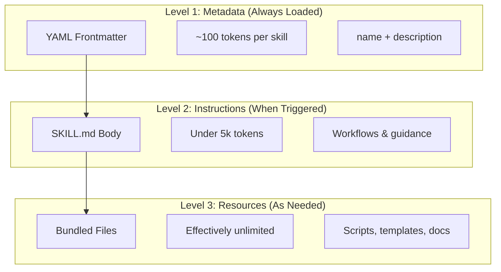
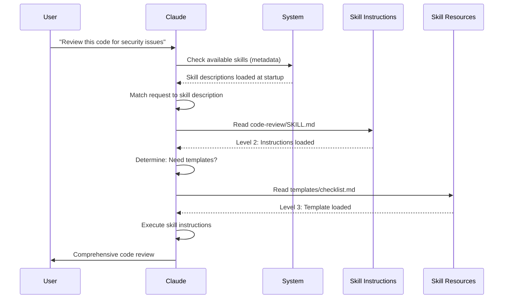

<picture>
  <source media="(prefers-color-scheme: dark)" srcset="../resources/logos/claude-howto-logo-dark.svg">
  
</picture>

# Agent Skills 指南

Agent Skills 是基于文件系统的可重用能力，用于扩展 Claude 的功能。它们将领域专业知识、工作流程和最佳实践打包成可被发现的组件，Claude 会在相关场景下自动使用。

## 概述

**Agent Skills** 是模块化能力，可以将通用型智能体转变为专业型智能体。与提示词（对话级别的一次性任务指令）不同，Skills 按需加载，无需在多次对话中反复提供相同的指导。

### 核心优势

- **专业化 Claude**：为特定领域任务定制能力
- **减少重复**：一次创建，跨对话自动使用
- **组合能力**：将多个 Skills 组合构建复杂工作流
- **规模化工作流**：跨多个项目和团队重用 Skills
- **保障质量**：将最佳实践直接嵌入工作流

Skills 遵循 [Agent Skills](https://agentskills.io) 开放标准，适用于多种 AI 工具。Claude Code 在此标准基础上扩展了额外功能，包括调用控制、子代理执行和动态上下文注入。

> **注意**：自定义斜杠命令已合并到 Skills 中。`.claude/commands/` 文件仍然有效，支持相同的 frontmatter 字段。建议新开发使用 Skills。当同一路径下两者同时存在时（例如 `.claude/commands/review.md` 和 `.claude/skills/review/SKILL.md`），Skill 优先。

## Skills 工作原理：渐进式披露

Skills 采用**渐进式披露**架构——Claude 根据需要分阶段加载信息，而非一次性消耗所有上下文。这实现了高效的上下文管理，同时保持无限可扩展性。

### 三级加载机制



| 级别 | 何时加载 | Token 消耗 | 内容 |
|-------|------------|------------|---------|
| **Level 1：元数据** | 始终加载（启动时） | 每个 Skill 约 100 tokens | YAML frontmatter 中的 `name` 和 `description` |
| **Level 2：指令** | Skill 被触发时 | 5k tokens 以内 | SKILL.md 正文，包含指令和指导 |
| **Level 3+：资源** | 按需加载 | 实际上无限制 | 通过 bash 执行的捆绑文件，无需加载内容到上下文 |

这意味着你可以安装大量 Skills 而不会产生上下文开销——在实际触发之前，Claude 只知道每个 Skill 的存在和使用时机。

## Skill 加载流程



## Skill 类型与位置

| 类型 | 位置 | 作用范围 | 共享 | 最适用于 |
|------|----------|-------|--------|----------|
| **企业级** | 托管设置 | 所有组织用户 | 是 | 组织范围标准 |
| **个人级** | `~/.claude/skills/<skill-name>/SKILL.md` | 个人 | 否 | 个人工作流 |
| **项目级** | `.claude/skills/<skill-name>/SKILL.md` | 团队 | 是（通过 git） | 团队标准 |
| **插件级** | `<plugin>/skills/<skill-name>/SKILL.md` | 启用范围 | 取决于具体情况 | 与插件捆绑 |

当不同级别的 Skills 同名时，更高优先级的位置生效：**企业级 > 个人级 > 项目级**。插件 Skills 使用 `plugin-name:skill-name` 命名空间，因此不会冲突。

### 自动发现

**嵌套目录**：当你在子目录中编辑文件时，Claude Code 会自动发现嵌套 `.claude/skills/` 目录中的 Skills。例如，如果你在 `packages/frontend/` 中编辑文件，Claude Code 也会在 `packages/frontend/.claude/skills/` 中查找 Skills。这支持 monorepo 架构，允许各个包拥有自己的 Skills。

**`--add-dir` 目录**：通过 `--add-dir` 添加的目录中的 Skills 会自动加载，并支持实时变更检测。对这些目录中 Skill 文件的任何编辑都会立即生效，无需重启 Claude Code。

**描述预算**：Skill 描述（Level 1 元数据）上限为**上下文窗口的 1%**（回退值：**8,000 字符**）。如果安装了大量 Skills，描述可能会被缩短。所有 Skill 名称始终包含在内，但描述会被裁剪以适应预算。请在描述开头放置关键用例。可通过 `SLASH_COMMAND_TOOL_CHAR_BUDGET` 环境变量覆盖预算。

## 创建自定义 Skills

### 基本目录结构

```
my-skill/
├── SKILL.md           # 主指令文件（必需）
├── template.md        # Claude 填写的模板
├── examples/
│   └── sample.md      # 示例输出，展示预期格式
└── scripts/
    └── validate.sh    # Claude 可执行的脚本
```

### SKILL.md 格式

```yaml
---
name: your-skill-name
description: Brief description of what this Skill does and when to use it
---

# Your Skill Name

## Instructions
Provide clear, step-by-step guidance for Claude.

## Examples
Show concrete examples of using this Skill.
```

### 必填字段

- **name**：仅限小写字母、数字、连字符（最多 64 个字符）。不能包含 "anthropic" 或 "claude"。
- **description**：描述 Skill 的功能以及何时使用（最多 1024 个字符）。这对 Claude 判断何时激活 Skill 至关重要。

### 可选 Frontmatter 字段

```yaml
---
name: my-skill
description: What this skill does and when to use it
argument-hint: "[filename] [format]"        # 自动补全提示
disable-model-invocation: true              # 仅用户可调用
user-invocable: false                       # 从斜杠菜单隐藏
allowed-tools: Read, Grep, Glob             # 限制工具访问
model: opus                                 # 指定使用的模型
effort: high                                # 努力级别覆盖（low, medium, high, max）
context: fork                               # 在隔离的子代理中运行
agent: Explore                              # 代理类型（配合 context: fork）
shell: bash                                 # 命令使用的 shell：bash（默认）或 powershell
hooks:                                      # Skill 作用域的钩子
  PreToolUse:
    - matcher: "Bash"
      hooks:
        - type: command
          command: "./scripts/validate.sh"
paths: "src/api/**/*.ts"               # 限制 Skill 激活的 Glob 模式
---
```

| 字段 | 说明 |
|-------|-------------|
| `name` | 仅限小写字母、数字、连字符（最多 64 个字符）。不能包含 "anthropic" 或 "claude"。 |
| `description` | 描述 Skill 的功能以及何时使用（最多 1024 个字符）。对自动调用匹配至关重要。 |
| `argument-hint` | `/` 自动补全菜单中显示的提示（例如 `"[filename] [format]"`）。 |
| `disable-model-invocation` | `true` = 仅用户可通过 `/name` 调用。Claude 永远不会自动调用。 |
| `user-invocable` | `false` = 从 `/` 菜单隐藏。仅 Claude 可自动调用。 |
| `allowed-tools` | 逗号分隔的工具列表，Skill 可在无需权限提示的情况下使用这些工具。 |
| `model` | Skill 激活时的模型覆盖（例如 `opus`、`sonnet`）。 |
| `effort` | Skill 激活时的努力级别覆盖：`low`、`medium`、`high` 或 `max`。 |
| `context` | `fork` 表示在具有独立上下文窗口的分叉子代理中运行 Skill。 |
| `agent` | 当 `context: fork` 时使用的子代理类型（例如 `Explore`、`Plan`、`general-purpose`）。 |
| `shell` | 用于 `!`command`` 替换和脚本的 shell：`bash`（默认）或 `powershell`。 |
| `hooks` | 作用于此 Skill 生命周期的钩子（格式与全局钩子相同）。 |
| `paths` | 限制 Skill 自动激活的 Glob 模式。逗号分隔的字符串或 YAML 列表。格式与路径特定规则相同。 |

## Skill 内容类型

Skills 可以包含两种类型的内容，各自适用于不同目的：

### 参考内容

添加 Claude 应用于当前工作的知识——约定、模式、风格指南、领域知识。在对话上下文中内联运行。

```yaml
---
name: api-conventions
description: API design patterns for this codebase
---

When writing API endpoints:
- Use RESTful naming conventions
- Return consistent error formats
- Include request validation
```

### 任务内容

用于特定操作的逐步指令。通常通过 `/skill-name` 直接调用。

```yaml
---
name: deploy
description: Deploy the application to production
context: fork
disable-model-invocation: true
---

Deploy the application:
1. Run the test suite
2. Build the application
3. Push to the deployment target
```

## 控制 Skill 调用

默认情况下，你和 Claude 都可以调用任何 Skill。两个 frontmatter 字段控制三种调用模式：

| Frontmatter | 你可以调用 | Claude 可以调用 |
|---|---|---|
| （默认） | 是 | 是 |
| `disable-model-invocation: true` | 是 | 否 |
| `user-invocable: false` | 否 | 是 |

**使用 `disable-model-invocation: true`** 适用于有副作用的工作流：`/commit`、`/deploy`、`/send-slack-message`。你不希望 Claude 仅因为代码看起来准备好了就决定执行部署。

**使用 `user-invocable: false`** 适用于不适合作为命令使用的背景知识。例如 `legacy-system-context` Skill 解释旧系统如何工作——对 Claude 有用，但对用户来说不是一个有意义的操作。

## 字符串替换

Skills 支持在内容到达 Claude 之前解析的动态值：

| 变量 | 说明 |
|----------|-------------|
| `$ARGUMENTS` | 调用 Skill 时传递的所有参数 |
| `$ARGUMENTS[N]` 或 `$N` | 按索引访问特定参数（从 0 开始） |
| `${CLAUDE_SESSION_ID}` | 当前会话 ID |
| `${CLAUDE_SKILL_DIR}` | 包含 Skill 的 SKILL.md 文件的目录 |
| `` !`command` `` | 动态上下文注入——运行 shell 命令并内联输出 |

**示例：**

```yaml
---
name: fix-issue
description: Fix a GitHub issue
---

Fix GitHub issue $ARGUMENTS following our coding standards.
1. Read the issue description
2. Implement the fix
3. Write tests
4. Create a commit
```

运行 `/fix-issue 123` 会将 `$ARGUMENTS` 替换为 `123`。

## 注入动态上下文

`` !`command` `` 语法在 Skill 内容发送给 Claude 之前运行 shell 命令：

```yaml
---
name: pr-summary
description: Summarize changes in a pull request
context: fork
agent: Explore
---

## Pull request context
- PR diff: !`gh pr diff`
- PR comments: !`gh pr view --comments`
- Changed files: !`gh pr diff --name-only`

## Your task
Summarize this pull request...
```

命令立即执行；Claude 只看到最终输出。默认情况下，命令在 `bash` 中运行。在 frontmatter 中设置 `shell: powershell` 可使用 PowerShell。

## 在子代理中运行 Skills

添加 `context: fork` 可在隔离的子代理上下文中运行 Skill。Skill 内容成为专用子代理的任务，拥有独立的上下文窗口，保持主对话整洁。

`agent` 字段指定使用哪种代理类型：

| 代理类型 | 最适用于 |
|---|---|
| `Explore` | 只读研究、代码库分析 |
| `Plan` | 创建实施计划 |
| `general-purpose` | 需要所有工具的广泛任务 |
| 自定义代理 | 在配置中定义的专业化代理 |

**示例 frontmatter：**

```yaml
---
context: fork
agent: Explore
---
```

**完整 Skill 示例：**

```yaml
---
name: deep-research
description: Research a topic thoroughly
context: fork
agent: Explore
---

Research $ARGUMENTS thoroughly:
1. Find relevant files using Glob and Grep
2. Read and analyze the code
3. Summarize findings with specific file references
```

## 实际案例

### 案例 1：代码审查 Skill

**目录结构：**

```
~/.claude/skills/code-review/
├── SKILL.md
├── templates/
│   ├── review-checklist.md
│   └── finding-template.md
└── scripts/
    ├── analyze-metrics.py
    └── compare-complexity.py
```

**文件：** `~/.claude/skills/code-review/SKILL.md`

```yaml
---
name: code-review-specialist
description: Comprehensive code review with security, performance, and quality analysis. Use when users ask to review code, analyze code quality, evaluate pull requests, or mention code review, security analysis, or performance optimization.
---

# Code Review Skill

This skill provides comprehensive code review capabilities focusing on:

1. **Security Analysis**
   - Authentication/authorization issues
   - Data exposure risks
   - Injection vulnerabilities
   - Cryptographic weaknesses

2. **Performance Review**
   - Algorithm efficiency (Big O analysis)
   - Memory optimization
   - Database query optimization
   - Caching opportunities

3. **Code Quality**
   - SOLID principles
   - Design patterns
   - Naming conventions
   - Test coverage

4. **Maintainability**
   - Code readability
   - Function size (should be < 50 lines)
   - Cyclomatic complexity
   - Type safety

## Review Template

For each piece of code reviewed, provide:

### Summary
- Overall quality assessment (1-5)
- Key findings count
- Recommended priority areas

### Critical Issues (if any)
- **Issue**: Clear description
- **Location**: File and line number
- **Impact**: Why this matters
- **Severity**: Critical/High/Medium
- **Fix**: Code example

For detailed checklists, see [templates/review-checklist.md](templates/review-checklist.md).
```

### 案例 2：代码库可视化 Skill

一个生成交互式 HTML 可视化的 Skill：

**目录结构：**

```
~/.claude/skills/codebase-visualizer/
├── SKILL.md
└── scripts/
    └── visualize.py
```

**文件：** `~/.claude/skills/codebase-visualizer/SKILL.md`

````yaml
---
name: codebase-visualizer
description: Generate an interactive collapsible tree visualization of your codebase. Use when exploring a new repo, understanding project structure, or identifying large files.
allowed-tools: Bash(python *)
---

# Codebase Visualizer

Generate an interactive HTML tree view showing your project's file structure.

## Usage

Run the visualization script from your project root:

```bash
python ~/.claude/skills/codebase-visualizer/scripts/visualize.py .
```

This creates `codebase-map.html` and opens it in your default browser.

## What the visualization shows

- **Collapsible directories**: Click folders to expand/collapse
- **File sizes**: Displayed next to each file
- **Colors**: Different colors for different file types
- **Directory totals**: Shows aggregate size of each folder
````

捆绑的 Python 脚本完成繁重工作，而 Claude 负责编排。

### 案例 3：部署 Skill（仅用户调用）

```yaml
---
name: deploy
description: Deploy the application to production
disable-model-invocation: true
allowed-tools: Bash(npm *), Bash(git *)
---

Deploy $ARGUMENTS to production:

1. Run the test suite: `npm test`
2. Build the application: `npm run build`
3. Push to the deployment target
4. Verify the deployment succeeded
5. Report deployment status
```

### 案例 4：品牌声音 Skill（背景知识）

```yaml
---
name: brand-voice
description: Ensure all communication matches brand voice and tone guidelines. Use when creating marketing copy, customer communications, or public-facing content.
user-invocable: false
---

## Tone of Voice
- **Friendly but professional** - approachable without being casual
- **Clear and concise** - avoid jargon
- **Confident** - we know what we're doing
- **Empathetic** - understand user needs

## Writing Guidelines
- Use "you" when addressing readers
- Use active voice
- Keep sentences under 20 words
- Start with value proposition

For templates, see [templates/](templates/).
```

### 案例 5：CLAUDE.md 生成器 Skill

```yaml
---
name: claude-md
description: Create or update CLAUDE.md files following best practices for optimal AI agent onboarding. Use when users mention CLAUDE.md, project documentation, or AI onboarding.
---

## Core Principles

**LLMs are stateless**: CLAUDE.md is the only file automatically included in every conversation.

### The Golden Rules

1. **Less is More**: Keep under 300 lines (ideally under 100)
2. **Universal Applicability**: Only include information relevant to EVERY session
3. **Don't Use Claude as a Linter**: Use deterministic tools instead
4. **Never Auto-Generate**: Craft it manually with careful consideration

## Essential Sections

- **Project Name**: Brief one-line description
- **Tech Stack**: Primary language, frameworks, database
- **Development Commands**: Install, test, build commands
- **Critical Conventions**: Only non-obvious, high-impact conventions
- **Known Issues / Gotchas**: Things that trip up developers
```

### 案例 6：重构 Skill（含脚本）

**目录结构：**

```
refactor/
├── SKILL.md
├── references/
│   ├── code-smells.md
│   └── refactoring-catalog.md
├── templates/
│   └── refactoring-plan.md
└── scripts/
    ├── analyze-complexity.py
    └── detect-smells.py
```

**文件：** `refactor/SKILL.md`

```yaml
---
name: code-refactor
description: Systematic code refactoring based on Martin Fowler's methodology. Use when users ask to refactor code, improve code structure, reduce technical debt, or eliminate code smells.
---

# Code Refactoring Skill

A phased approach emphasizing safe, incremental changes backed by tests.

## Workflow

Phase 1: Research & Analysis → Phase 2: Test Coverage Assessment →
Phase 3: Code Smell Identification → Phase 4: Refactoring Plan Creation →
Phase 5: Incremental Implementation → Phase 6: Review & Iteration

## Core Principles

1. **Behavior Preservation**: External behavior must remain unchanged
2. **Small Steps**: Make tiny, testable changes
3. **Test-Driven**: Tests are the safety net
4. **Continuous**: Refactoring is ongoing, not a one-time event

For code smell catalog, see [references/code-smells.md](references/code-smells.md).
For refactoring techniques, see [references/refactoring-catalog.md](references/refactoring-catalog.md).
```

## 辅助文件

Skills 可以在其目录中包含 `SKILL.md` 之外的多个文件。这些辅助文件（模板、示例、脚本、参考文档）让你可以保持主 Skill 文件的精简，同时为 Claude 提供按需加载的额外资源。

```
my-skill/
├── SKILL.md              # 主指令文件（必需，保持在 500 行以内）
├── templates/            # Claude 填写的模板
│   └── output-format.md
├── examples/             # 示例输出，展示预期格式
│   └── sample-output.md
├── references/           # 领域知识和规范
│   └── api-spec.md
└── scripts/              # Claude 可执行的脚本
    └── validate.sh
```

辅助文件指南：

- 将 `SKILL.md` 保持在 **500 行**以内。将详细的参考材料、大型示例和规范移至单独的文件。
- 在 `SKILL.md` 中使用**相对路径**引用其他文件（例如 `[API reference](references/api-spec.md)`）。
- 辅助文件在 Level 3（按需加载）时加载，因此在 Claude 实际读取之前不会消耗上下文。

## 管理 Skills

### 查看可用 Skills

直接询问 Claude：
```
What Skills are available?
```

或检查文件系统：
```bash
# 列出个人 Skills
ls ~/.claude/skills/

# 列出项目 Skills
ls .claude/skills/
```

### 测试 Skill

两种测试方式：

**让 Claude 自动调用**，提出与描述匹配的请求：
```
Can you help me review this code for security issues?
```

**或直接调用**，使用 Skill 名称：
```
/code-review src/auth/login.ts
```

### 更新 Skill

直接编辑 `SKILL.md` 文件。更改在下次 Claude Code 启动时生效。

```bash
# 个人 Skill
code ~/.claude/skills/my-skill/SKILL.md

# 项目 Skill
code .claude/skills/my-skill/SKILL.md
```

### 限制 Claude 的 Skill 访问

三种方式控制 Claude 可调用哪些 Skills：

**禁用所有 Skills**，在 `/permissions` 中设置：
```
# Add to deny rules:
Skill
```

**允许或拒绝特定 Skills**：
```
# Allow only specific skills
Skill(commit)
Skill(review-pr *)

# Deny specific skills
Skill(deploy *)
```

**隐藏单个 Skill**，在其 frontmatter 中添加 `disable-model-invocation: true`。

## 最佳实践

### 1. 使描述具体明确

- **差（模糊）**："Helps with documents"
- **好（具体）**："Extract text and tables from PDF files, fill forms, merge documents. Use when working with PDF files or when the user mentions PDFs, forms, or document extraction."

### 2. 保持 Skills 专注

- 一个 Skill = 一个能力
- ✅ "PDF form filling"
- ❌ "Document processing"（太宽泛）

### 3. 包含触发词

在描述中添加与用户请求匹配的关键词：
```yaml
description: Analyze Excel spreadsheets, generate pivot tables, create charts. Use when working with Excel files, spreadsheets, or .xlsx files.
```

### 4. 将 SKILL.md 保持在 500 行以内

将详细的参考材料移至 Claude 按需加载的单独文件。

### 5. 引用辅助文件

```markdown
## Additional resources

- For complete API details, see [reference.md](reference.md)
- For usage examples, see [examples.md](examples.md)
```

### 应该做的

- 使用清晰、描述性的名称
- 包含全面的指令
- 添加具体的示例
- 打包相关的脚本和模板
- 用真实场景测试
- 记录依赖项

### 不应该做的

- 不要为一次性任务创建 Skills
- 不要重复已有的功能
- 不要让 Skills 范围太广
- 不要省略 description 字段
- 不要安装未经审计的不可信来源的 Skills

## 故障排除

### 快速参考

| 问题 | 解决方案 |
|-------|----------|
| Claude 不使用 Skill | 使描述更具体，包含触发词 |
| 找不到 Skill 文件 | 验证路径：`~/.claude/skills/name/SKILL.md` |
| YAML 错误 | 检查 `---` 标记、缩进、不要使用制表符 |
| Skills 冲突 | 在描述中使用不同的触发词 |
| 脚本不运行 | 检查权限：`chmod +x scripts/*.py` |
| Claude 看不到所有 Skills | Skills 过多；用 `/context` 检查警告 |

### Skill 未触发

如果 Claude 未在预期时使用你的 Skill：

1. 检查描述是否包含用户自然会说的关键词
2. 验证询问 "What skills are available?" 时 Skill 是否出现
3. 尝试重新措辞你的请求以匹配描述
4. 使用 `/skill-name` 直接调用来测试

### Skill 触发过于频繁

如果 Claude 在你不需要时使用了 Skill：

1. 使描述更具体
2. 添加 `disable-model-invocation: true` 设为仅手动调用

### Claude 看不到所有 Skills

Skill 描述以**上下文窗口的 1%** 为上限加载（回退值：**8,000 字符**）。每个条目无论预算如何都限制在 250 个字符以内。运行 `/context` 检查关于被排除 Skills 的警告。可通过 `SLASH_COMMAND_TOOL_CHAR_BUDGET` 环境变量覆盖预算。

## 安全注意事项

**仅使用来自可信来源的 Skills。** Skills 通过指令和代码为 Claude 提供能力——恶意 Skill 可以指示 Claude 以有害方式调用工具或执行代码。

**关键安全考虑：**

- **彻底审计**：审查 Skill 目录中的所有文件
- **外部来源有风险**：从外部 URL 获取内容的 Skills 可能被入侵
- **工具滥用**：恶意 Skills 可以以有害方式调用工具
- **视同安装软件**：仅使用来自可信来源的 Skills

### 在 Skills 中禁用 shell 替换

Skills 支持 `` !`command` `` 语法，在 Claude 看到之前将 shell 命令的输出注入提示。在安全敏感环境（共享企业部署、锁定的 CI 运行器）中，可以通过 `disableSkillShellExecution` 设置完全禁用此替换（在 **v2.1.91** 中添加）：

```jsonc
// ~/.claude/settings.json or managed policy
{
  "disableSkillShellExecution": true
}
```

当 `disableSkillShellExecution` 为 `true` 时，Skill 中的任何 `` !`command` `` 标记将保留为字面文本而不被执行——消除了 Skill 级别的 shell 注入攻击面，同时不会禁用 Skills 本身。建议将此与 `allowedTools` 允许列表结合使用以实现纵深防御。

## Skills 与其他功能对比

| 功能 | 调用方式 | 最适用于 |
|---------|------------|----------|
| **Skills** | 自动或 `/name` | 可重用的专业知识、工作流 |
| **Slash Commands** | 用户发起 `/name` | 快捷方式（已合并到 Skills） |
| **Subagents** | 自动委派 | 隔离的任务执行 |
| **Memory (CLAUDE.md)** | 始终加载 | 持久化项目上下文 |
| **MCP** | 实时 | 外部数据/服务访问 |
| **Hooks** | 事件驱动 | 自动化副作用 |

## 内置 Skills

Claude Code 自带数个内置 Skills，无需安装即可使用：

| Skill | 说明 |
|-------|-------------|
| `/simplify` | 审查已更改的文件，检查复用性、质量和效率；生成 3 个并行审查代理 |
| `/batch <instruction>` | 使用 git worktrees 编排跨代码库的大规模并行变更 |
| `/debug [description]` | 通过读取调试日志排查当前会话问题 |
| `/loop [interval] <prompt>` | 按间隔重复运行提示（例如 `/loop 5m check the deploy`） |
| `/claude-api` | 加载 Claude API/SDK 参考；在 `anthropic`/`@anthropic-ai/sdk` 导入时自动激活 |

这些 Skills 开箱即用，无需安装或配置。它们遵循与自定义 Skills 相同的 SKILL.md 格式。

## 共享 Skills

### 项目 Skills（团队共享）

1. 在 `.claude/skills/` 中创建 Skill
2. 提交到 git
3. 团队成员拉取更改——Skills 立即可用

### 个人 Skills

```bash
# 复制到个人目录
cp -r my-skill ~/.claude/skills/

# 使脚本可执行
chmod +x ~/.claude/skills/my-skill/scripts/*.py
```

### 插件分发

将 Skills 打包到插件的 `skills/` 目录中以实现更广泛的分发。

## 更进一步：Skill 集合与 Skill 管理器

当你开始认真构建 Skills 时，有两样东西变得必不可少：经过验证的 Skill 库和管理工具。

**[luongnv89/skills](https://github.com/luongnv89/skills)** — 我在几乎所有项目中每天使用的 Skill 集合。亮点包括 `logo-designer`（即时生成项目 logo）和 `ollama-optimizer`（根据你的硬件调优本地 LLM 性能）。如果你需要开箱即用的 Skills，这是一个很好的起点。

**[luongnv89/asm](https://github.com/luongnv89/asm)** — Agent Skill Manager。处理 Skill 开发、重复检测和测试。`asm link` 命令让你可以在任何项目中测试 Skill，而无需复制文件——当你拥有大量 Skills 时这是必不可少的。

## 其他资源

- [官方 Skills 文档](https://code.claude.com/docs/en/skills)
- [Agent Skills 架构博客](https://claude.com/blog/equipping-agents-for-the-real-world-with-agent-skills)
- [Skills 仓库](https://github.com/luongnv89/skills) - 即用型 Skill 集合
- [Slash Commands 指南](../01-slash-commands/) - 用户发起的快捷方式
- [Subagents 指南](../04-subagents/) - 委派式 AI 代理
- [Memory 指南](../02-memory/) - 持久化上下文
- [MCP（模型上下文协议）](../05-mcp/) - 实时外部数据
- [Hooks 指南](../06-hooks/) - 事件驱动自动化

---
**最后更新**：2026 年 4 月 24 日
**Claude Code 版本**：2.1.119
**来源**：
- https://code.claude.com/docs/en/skills
- https://code.claude.com/docs/en/settings
- https://code.claude.com/docs/en/changelog
**兼容模型**：Claude Sonnet 4.6、Claude Opus 4.7、Claude Haiku 4.5
