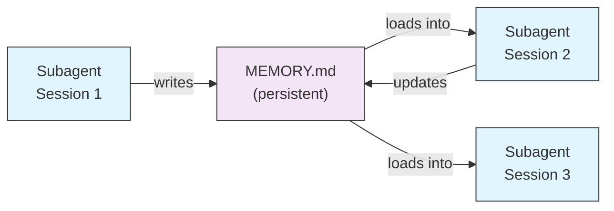
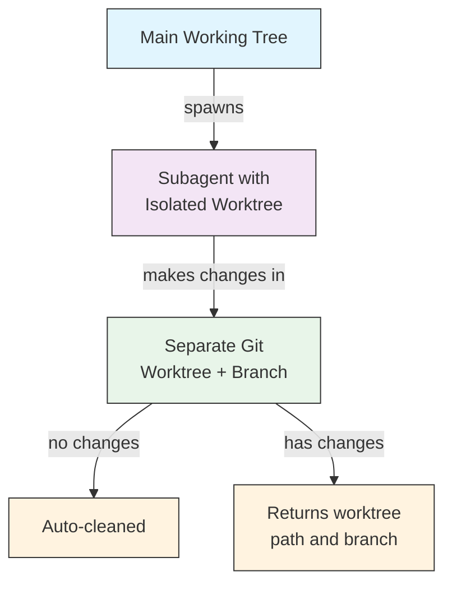
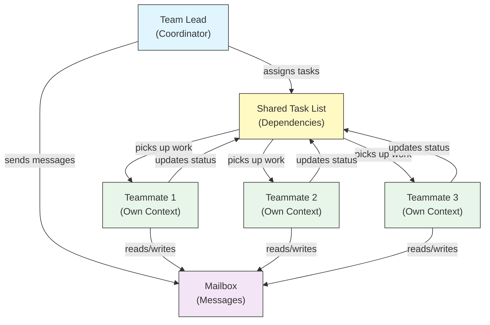
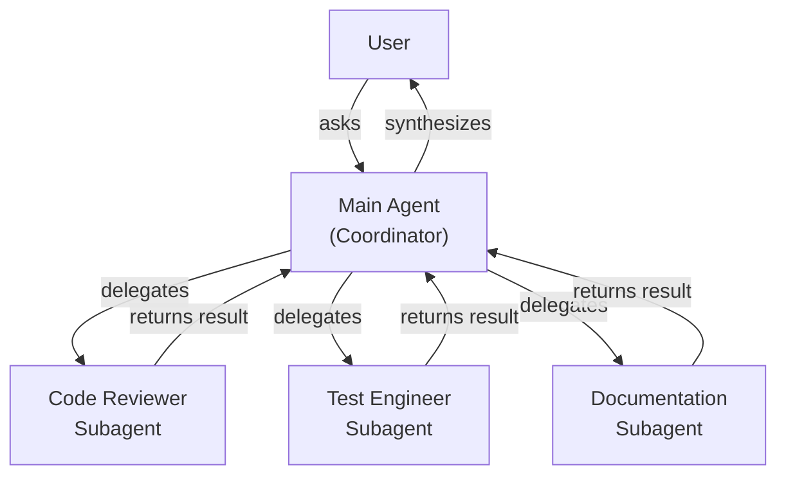
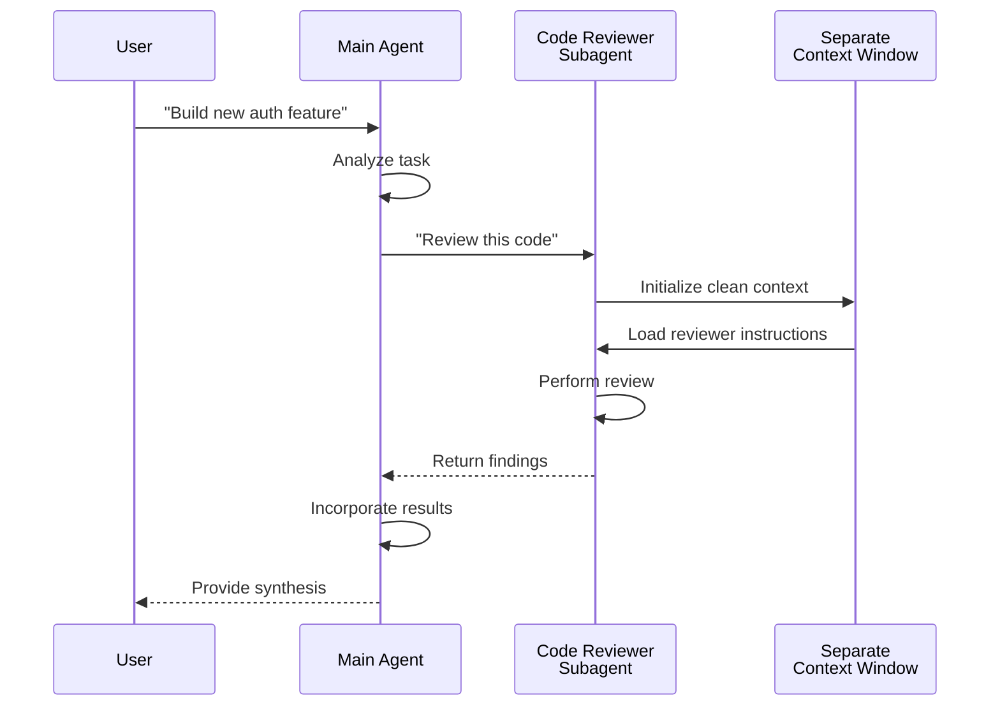
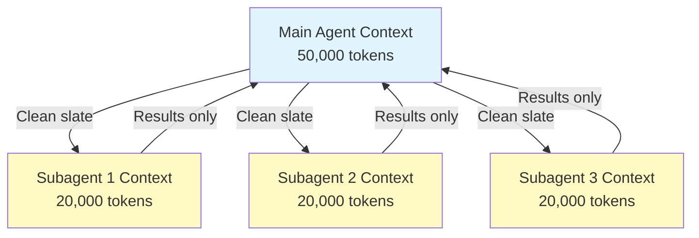
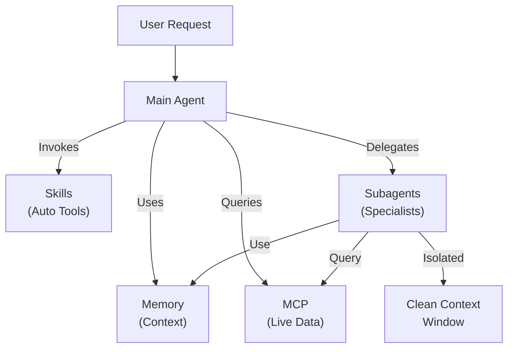

<picture>
  <source media="(prefers-color-scheme: dark)" srcset="../resources/logos/claude-howto-logo-dark.svg">
  
</picture>

# Subagent - 完整参考指南

Subagent 是 Claude Code 可以将任务委派给的专用 AI 助手。每个 subagent 都有特定的用途，使用与主对话分离的独立 context window，并且可以配置特定的工具和自定义 system prompt。

## 目录

1. [概述](#overview)
2. [核心优势](#key-benefits)
3. [文件位置](#file-locations)
4. [配置](#configuration)
5. [内置 Subagent](#built-in-subagents)
6. [管理 Subagent](#managing-subagents)
7. [使用 Subagent](#using-subagents)
8. [可恢复 Agent](#resumable-agents)
9. [链式 Subagent](#chaining-subagents)
10. [Subagent 持久化记忆](#persistent-memory-for-subagents)
11. [后台 Subagent](#background-subagents)
12. [Worktree 隔离](#worktree-isolation)
13. [限制可生成的 Subagent](#restrict-spawnable-subagents)
14. [`claude agents` CLI 命令](#claude-agents-cli-command)
15. [Agent Teams（实验性功能）](#agent-teams-experimental)
16. [Plugin Subagent 安全性](#plugin-subagent-security)
17. [架构](#architecture)
18. [上下文管理](#context-management)
19. [何时使用 Subagent](#when-to-use-subagents)
20. [最佳实践](#best-practices)
21. [本文件夹中的示例 Subagent](#example-subagents-in-this-folder)
22. [安装说明](#installation-instructions)
23. [相关概念](#related-concepts)

---

## 概述

Subagent 通过以下方式在 Claude Code 中实现委派任务执行：

- 创建具有独立 context window 的**隔离 AI 助手**
- 提供**自定义 system prompt** 以获得专业能力
- 实施**工具访问控制**以限制功能范围
- 防止复杂任务造成的**上下文污染**
- 支持多个专业任务的**并行执行**

每个 subagent 都以全新状态独立运行，仅接收其任务所需的特定上下文，然后将结果返回给主 agent 进行综合处理。

**快速开始**：使用 `/agents` 命令可以交互式地创建、查看、编辑和管理你的 subagent。

---

## 核心优势

| 优势 | 描述 |
|---------|-------------|
| **上下文保持** | 在独立的上下文中运行，防止主对话被污染 |
| **专业能力** | 针对特定领域进行调优，成功率更高 |
| **可复用性** | 可在不同项目中使用，并与团队共享 |
| **灵活的权限** | 不同类型的 subagent 拥有不同的工具访问级别 |
| **可扩展性** | 多个 agent 可同时处理不同方面的任务 |

---

## 文件位置

Subagent 文件可以存储在多个位置，具有不同的作用域：

| 优先级 | 类型 | 位置 | 作用域 |
|----------|------|----------|-------|
| 1（最高） | **CLI 定义** | 通过 `--agents` 标志（JSON） | 仅当前会话 |
| 2 | **项目 subagent** | `.claude/agents/` | 当前项目 |
| 3 | **用户 subagent** | `~/.claude/agents/` | 所有项目 |
| 4（最低） | **Plugin agent** | Plugin `agents/` 目录 | 通过 plugin |

当存在重复名称时，优先级更高的来源优先生效。

---

## 配置

### 文件格式

Subagent 通过 YAML frontmatter 定义，后跟 markdown 格式的 system prompt：

```yaml
---
name: your-sub-agent-name
description: Description of when this subagent should be invoked
tools: tool1, tool2, tool3  # Optional - inherits all tools if omitted
disallowedTools: tool4  # Optional - explicitly disallowed tools
model: sonnet  # Optional - sonnet, opus, haiku, or inherit
permissionMode: default  # Optional - permission mode
maxTurns: 20  # Optional - limit agentic turns
skills: skill1, skill2  # Optional - skills to preload into context
mcpServers: server1  # Optional - MCP servers to make available
memory: user  # Optional - persistent memory scope (user, project, local)
background: false  # Optional - run as background task
effort: high  # Optional - reasoning effort (low, medium, high, max)
isolation: worktree  # Optional - git worktree isolation
initialPrompt: "Start by analyzing the codebase"  # Optional - auto-submitted first turn
hooks:  # Optional - component-scoped hooks
  PreToolUse:
    - matcher: "Bash"
      hooks:
        - type: command
          command: "./scripts/security-check.sh"
---

Your subagent's system prompt goes here. This can be multiple paragraphs
and should clearly define the subagent's role, capabilities, and approach
to solving problems.
```

### 配置字段

| 字段 | 必填 | 描述 |
|-------|----------|-------------|
| `name` | 是 | 唯一标识符（小写字母和连字符） |
| `description` | 是 | 描述用途的自然语言。包含 "use PROACTIVELY" 可鼓励自动调用 |
| `tools` | 否 | 逗号分隔的特定工具列表。省略则继承所有工具。支持 `Agent(agent_name)` 语法来限制可生成的 subagent |
| `disallowedTools` | 否 | 逗号分隔的 subagent 禁止使用的工具列表 |
| `model` | 否 | 使用的模型：`sonnet`、`opus`、`haiku`、完整模型 ID 或 `inherit`。默认为已配置的 subagent 模型 |
| `permissionMode` | 否 | `default`、`acceptEdits`、`dontAsk`、`bypassPermissions`、`plan` |
| `maxTurns` | 否 | Subagent 可执行的最大 agent 轮次数 |
| `skills` | 否 | 逗号分隔的要预加载的 skill 列表。在启动时将完整的 skill 内容注入 subagent 的上下文中 |
| `mcpServers` | 否 | 提供给 subagent 使用的 MCP 服务器 |
| `hooks` | 否 | 组件级 hook（PreToolUse、PostToolUse、Stop） |
| `memory` | 否 | 持久化记忆目录作用域：`user`、`project` 或 `local` |
| `background` | 否 | 设置为 `true` 则始终以后台任务运行此 subagent |
| `effort` | 否 | 推理努力级别：`low`、`medium`、`high` 或 `max` |
| `isolation` | 否 | 设置为 `worktree` 可为 subagent 提供独立的 git worktree |
| `initialPrompt` | 否 | 当 subagent 作为主 agent 运行时自动提交的首轮提示 |

### 主线程 Agent Frontmatter 生效机制（v2.1.117+/v2.1.119+）

当 agent 作为主线程 agent 被调用时（通过 `claude --agent <name>` 或 `--print` 模式），以下 frontmatter 字段会被采用：

| 字段 | 版本 | 说明 |
|-------|---------|-------|
| `mcpServers` | v2.1.117+ | 通过 `claude --agent <name>` 作为主线程 agent 调用时加载 |
| `permissionMode` | v2.1.119+ | 通过 `--agent <name>` 对内置 agent 生效 |
| `tools` / `disallowedTools` | v2.1.119+ | 在 `--print` 模式（非交互式/脚本使用）下生效 |

**示例 — 带 `mcpServers` 和 `permissionMode` 的 agent：**

```yaml
---
name: secure-researcher
description: Research agent with scoped MCP access and restricted permissions
permissionMode: acceptEdits
mcpServers:
  notion:
    type: http
    url: https://mcp.notion.com/mcp
  github:
    type: http
    url: https://api.github.com/mcp
tools: Read, Grep, Glob
---

You are a research agent. You may query Notion and GitHub through the
configured MCP servers, and read local files, but you cannot write or
execute commands outside of accepted edits.
```

运行方式：

```bash
claude --agent secure-researcher
```

### 工具配置选项

**选项 1：继承所有工具（省略该字段）**
```yaml
---
name: full-access-agent
description: Agent with all available tools
---
```

**选项 2：指定特定工具**
```yaml
---
name: limited-agent
description: Agent with specific tools only
tools: Read, Grep, Glob, Bash
---
```

> **关于 Glob/Grep 的说明（v2.1.113+）：** 在原生 macOS/Linux 构建中，Glob 和 Grep 通过 Bash 工具以 `bfs`/`ugrep` 的形式提供，而非独立工具。Windows 和 npm-JS 构建仍将其作为独立工具公开。作者仍可在 `allowedTools` 中引用 Glob/Grep；后端替换是透明的。

**选项 3：条件性工具访问**
```yaml
---
name: conditional-agent
description: Agent with filtered tool access
tools: Read, Bash(npm:*), Bash(test:*)
---
```

### 基于 CLI 的配置

使用 `--agents` 标志以 JSON 格式为单次会话定义 subagent：

```bash
claude --agents '{
  "code-reviewer": {
    "description": "Expert code reviewer. Use proactively after code changes.",
    "prompt": "You are a senior code reviewer. Focus on code quality, security, and best practices.",
    "tools": ["Read", "Grep", "Glob", "Bash"],
    "model": "sonnet"
  }
}'
```

**`--agents` 标志的 JSON 格式：**

```json
{
  "agent-name": {
    "description": "Required: when to invoke this agent",
    "prompt": "Required: system prompt for the agent",
    "tools": ["Optional", "array", "of", "tools"],
    "model": "optional: sonnet|opus|haiku"
  }
}
```

**Agent 定义的优先级：**

Agent 定义按以下优先级顺序加载（首次匹配生效）：
1. **CLI 定义** - `--agents` 标志（仅当前会话，JSON）
2. **项目级** - `.claude/agents/`（当前项目）
3. **用户级** - `~/.claude/agents/`（所有项目）
4. **Plugin 级** - Plugin `agents/` 目录

这允许 CLI 定义在单次会话中覆盖所有其他来源。

---

## 内置 Subagent

Claude Code 包含几个始终可用的内置 subagent：

| Agent | 模型 | 用途 |
|-------|-------|---------|
| **general-purpose** | 继承 | 复杂的多步骤任务 |
| **Plan** | 继承 | 计划模式下的研究 |
| **Explore** | Haiku | 只读代码库探索（快速/中等/非常深入） |
| **Bash** | 继承 | 在独立上下文中执行终端命令 |
| **statusline-setup** | Sonnet | 配置状态栏 |
| **Claude Code Guide** | Haiku | 回答 Claude Code 功能相关问题 |

### General-Purpose Subagent

| 属性 | 值 |
|----------|-------|
| **模型** | 继承自父级 |
| **工具** | 所有工具 |
| **用途** | 复杂的研究任务、多步骤操作、代码修改 |

**使用场景**：需要探索和修改并包含复杂推理的任务。

### Plan Subagent

| 属性 | 值 |
|----------|-------|
| **模型** | 继承自父级 |
| **工具** | Read、Glob、Grep、Bash |
| **用途** | 在计划模式下自动用于研究代码库 |

**使用场景**：当 Claude 在提出计划之前需要理解代码库时。

### Explore Subagent

| 属性 | 值 |
|----------|-------|
| **模型** | Haiku（快速、低延迟） |
| **模式** | 严格只读 |
| **工具** | Glob、Grep、Read、Bash（仅限只读命令） |
| **用途** | 快速搜索和分析代码库 |

**使用场景**：在不进行修改的情况下搜索/理解代码。

**深入程度** - 指定探索的深度：
- **"quick"** - 以最少的探索进行快速搜索，适合查找特定模式
- **"medium"** - 中等程度的探索，在速度和深度之间取得平衡，默认方式
- **"very thorough"** - 跨多个位置和命名约定进行全面分析，可能需要更长时间

### Bash Subagent

| 属性 | 值 |
|----------|-------|
| **模型** | 继承自父级 |
| **工具** | Bash |
| **用途** | 在独立的 context window 中执行终端命令 |

**使用场景**：当运行受益于隔离上下文的 shell 命令时。

### Statusline Setup Subagent

| 属性 | 值 |
|----------|-------|
| **模型** | Sonnet |
| **工具** | Read、Write、Bash |
| **用途** | 配置 Claude Code 状态栏显示 |

**使用场景**：设置或自定义状态栏时。

### Claude Code Guide Subagent

| 属性 | 值 |
|----------|-------|
| **模型** | Haiku（快速、低延迟） |
| **工具** | 只读 |
| **用途** | 回答关于 Claude Code 功能和用法的问题 |

**使用场景**：当用户询问 Claude Code 如何工作或如何使用特定功能时。

---

## 管理 Subagent

### 使用 `/agents` 命令（推荐）

```bash
/agents
```

这提供了一个交互式菜单，可以：
- 查看所有可用的 subagent（内置、用户和项目级）
- 通过引导式设置创建新的 subagent
- 编辑现有的自定义 subagent 和工具访问权限
- 删除自定义 subagent
- 查看存在重复时哪些 subagent 处于活动状态

### 直接文件管理

```bash
# Create a project subagent
mkdir -p .claude/agents
cat > .claude/agents/test-runner.md << 'EOF'
---
name: test-runner
description: Use proactively to run tests and fix failures
---

You are a test automation expert. When you see code changes, proactively
run the appropriate tests. If tests fail, analyze the failures and fix
them while preserving the original test intent.
EOF

# Create a user subagent (available in all projects)
mkdir -p ~/.claude/agents
```

---

## 使用 Subagent

### 自动委派

Claude 根据以下因素主动委派任务：
- 你请求中的任务描述
- Subagent 配置中的 `description` 字段
- 当前上下文和可用工具

要鼓励主动使用，请在 `description` 字段中包含 "use PROACTIVELY" 或 "MUST BE USED"：

```yaml
---
name: code-reviewer
description: Expert code review specialist. Use PROACTIVELY after writing or modifying code.
---
```

### 显式调用

你可以显式请求特定的 subagent：

```
> Use the test-runner subagent to fix failing tests
> Have the code-reviewer subagent look at my recent changes
> Ask the debugger subagent to investigate this error
```

### @-Mention 调用

使用 `@` 前缀来保证调用特定的 subagent（绕过自动委派启发式规则）：

```
> @"code-reviewer (agent)" review the auth module
```

### 会话级 Agent

使用特定 agent 作为主 agent 运行整个会话：

```bash
# Via CLI flag
claude --agent code-reviewer

# Via settings.json
{
  "agent": "code-reviewer"
}
```

### 列出可用 Agent

使用 `claude agents` 命令列出来自所有来源的已配置 agent：

```bash
claude agents
```

---

## 可恢复 Agent

Subagent 可以继续之前的对话，完整保留上下文：

```bash
# Initial invocation
> Use the code-analyzer agent to start reviewing the authentication module
# Returns agentId: "abc123"

# Resume the agent later
> Resume agent abc123 and now analyze the authorization logic as well
```

**使用场景**：
- 跨多个会话的长时间研究
- 不丢失上下文的迭代式优化
- 保持上下文的多步骤工作流

---

## 链式 Subagent

按顺序执行多个 subagent：

```bash
> First use the code-analyzer subagent to find performance issues,
  then use the optimizer subagent to fix them
```

这使得复杂的工作流成为可能，一个 subagent 的输出可以作为另一个的输入。

---

## Subagent 持久化记忆

`memory` 字段赋予 subagent 跨对话持久存在的目录。这允许 subagent 随时间积累知识，存储笔记、发现和上下文，在会话之间持续保留。

### 记忆作用域

| 作用域 | 目录 | 使用场景 |
|-------|-----------|----------|
| `user` | `~/.claude/agent-memory/<name>/` | 跨所有项目的个人笔记和偏好 |
| `project` | `.claude/agent-memory/<name>/` | 与团队共享的项目特定知识 |
| `local` | `.claude/agent-memory-local/<name>/` | 不提交到版本控制的本地项目知识 |

### 工作原理

- 记忆目录中 `MEMORY.md` 的前 200 行会自动加载到 subagent 的 system prompt 中
- `Read`、`Write` 和 `Edit` 工具会自动启用，供 subagent 管理其记忆文件
- Subagent 可以根据需要在其记忆目录中创建额外的文件

### 配置示例

```yaml
---
name: researcher
memory: user
---

You are a research assistant. Use your memory directory to store findings,
track progress across sessions, and build up knowledge over time.

Check your MEMORY.md file at the start of each session to recall previous context.
```



---

## 后台 Subagent

Subagent 可以在后台运行，释放主对话用于其他任务。

### 配置

在 frontmatter 中设置 `background: true` 以始终将 subagent 作为后台任务运行：

```yaml
---
name: long-runner
background: true
description: Performs long-running analysis tasks in the background
---
```

### 键盘快捷键

| 快捷键 | 操作 |
|----------|--------|
| `Ctrl+B` | 将当前运行的 subagent 任务切换到后台 |
| `Ctrl+F` | 终止所有后台 agent（按两次确认） |

### 禁用后台任务

设置环境变量以完全禁用后台任务支持：

```bash
export CLAUDE_CODE_DISABLE_BACKGROUND_TASKS=1
```

---

## Worktree 隔离

`isolation: worktree` 设置为 subagent 提供独立的 git worktree，使其能够独立进行更改而不影响主工作树。

### 配置

```yaml
---
name: feature-builder
isolation: worktree
description: Implements features in an isolated git worktree
tools: Read, Write, Edit, Bash, Grep, Glob
---
```

### 工作原理



- Subagent 在独立的 git worktree 上以单独的分支运行
- 如果 subagent 未进行任何更改，worktree 会自动清理
- 如果存在更改，worktree 路径和分支名称会返回给主 agent 以供审查或合并

---

## 分叉 Subagent

分叉 subagent（`context: fork`）在分叉时继承父 agent 的完整对话上下文，而非从全新状态开始。这对于在不丢失已完成工作的情况下探索替代路径非常有用。

> **可用性**：在 v2.1.117 正式发布。在外部构建（非第一方发行版）上，设置 `CLAUDE_CODE_FORK_SUBAGENT=1` 以启用分叉功能。

### 配置

```yaml
---
name: alternative-explorer
description: Explore an alternative implementation path while preserving parent context
context: fork
tools: Read, Edit, Bash, Grep, Glob
---

You are a forked subagent. You inherit the parent's full conversation and
may explore an alternative approach. Return your findings and the parent
will decide whether to adopt them.
```

### 在外部构建上启用

```bash
export CLAUDE_CODE_FORK_SUBAGENT=1
claude
```

### 何时使用分叉 vs 全新上下文

| 场景 | `context: fork` | 全新上下文（默认） |
|----------|-----------------|-------------------------|
| 探索替代实现方案 | 是 | 否（会丢失上下文） |
| 基于现有上下文的长时间研究 | 是 | 否 |
| 独立的专业化任务 | 否 | 是 |
| 避免上下文污染 | 否 | 是 |

---

## 限制可生成的 Subagent

你可以通过在 `tools` 字段中使用 `Agent(agent_type)` 语法来控制某个 subagent 可以生成哪些 subagent。这提供了一种白名单机制来限定可委派的 subagent。

> **注意**：在 v2.1.63 中，`Task` 工具被重命名为 `Agent`。现有的 `Task(...)` 引用仍然可以作为别名使用。

### 示例

```yaml
---
name: coordinator
description: Coordinates work between specialized agents
tools: Agent(worker, researcher), Read, Bash
---

You are a coordinator agent. You can delegate work to the "worker" and
"researcher" subagents only. Use Read and Bash for your own exploration.
```

在此示例中，`coordinator` subagent 只能生成 `worker` 和 `researcher` subagent。即使在其他地方定义了其他 subagent，它也无法生成它们。

---

## `claude agents` CLI 命令

`claude agents` 命令按来源分组（内置、用户级、项目级）列出所有已配置的 agent：

```bash
claude agents
```

此命令：
- 显示来自所有来源的可用 agent
- 按来源位置分组显示 agent
- 当较高优先级的 agent 覆盖较低优先级的同名 agent 时（例如，项目级 agent 与用户级 agent 同名），会标示**覆盖关系**

---

## Agent Teams（实验性功能）

Agent Teams 协调多个 Claude Code 实例共同处理复杂任务。与 subagent（委派子任务并返回结果）不同，队友独立工作，拥有自己的 context window，并可以通过共享邮箱系统直接互相发送消息。

> **官方文档**：[code.claude.com/docs/en/agent-teams](https://code.claude.com/docs/en/agent-teams)

> **注意**：Agent Teams 是实验性功能，默认禁用。需要 Claude Code v2.1.32+。使用前请先启用。

### Subagent vs Agent Teams

| 方面 | Subagent | Agent Teams |
|--------|-----------|-------------|
| **委派模型** | 父级委派子任务，等待结果 | 团队负责人协调工作，队友独立执行 |
| **上下文** | 每个子任务全新上下文，结果精炼后返回 | 每个队友维护自己的持久 context window |
| **协调方式** | 顺序或并行，由父级管理 | 共享任务列表，自动依赖管理 |
| **通信** | 结果仅返回给父级（无 agent 间消息传递） | 队友可通过邮箱直接互相发送消息 |
| **会话恢复** | 支持 | 进程内队友不支持 |
| **最适用于** | 聚焦的、定义明确的子任务 | 需要 agent 间通信和并行执行的复杂工作 |

### 启用 Agent Teams

设置环境变量或将其添加到 `settings.json`：

```bash
export CLAUDE_CODE_EXPERIMENTAL_AGENT_TEAMS=1
```

或在 `settings.json` 中：

```json
{
  "env": {
    "CLAUDE_CODE_EXPERIMENTAL_AGENT_TEAMS": "1"
  }
}
```

### 启动团队

启用后，在提示中要求 Claude 与队友协作：

```
User: Build the authentication module. Use a team — one teammate for the API endpoints,
      one for the database schema, and one for the test suite.
```

Claude 将自动创建团队、分配任务并协调工作。

### 显示模式

控制队友活动的显示方式：

| 模式 | 标志 | 描述 |
|------|------|-------------|
| **自动** | `--teammate-mode auto` | 自动为你的终端选择最佳显示模式 |
| **进程内**（默认） | `--teammate-mode in-process` | 在当前终端内联显示队友输出 |
| **分屏** | `--teammate-mode tmux` | 在独立的 tmux 或 iTerm2 面板中打开每个队友 |

```bash
claude --teammate-mode tmux
```

你也可以在 `settings.json` 中设置显示模式：

```json
{
  "teammateMode": "tmux"
}
```

> **注意**：分屏模式需要 tmux 或 iTerm2。在 VS Code 终端、Windows Terminal 或 Ghostty 中不可用。

### 导航

在分屏模式下使用 `Shift+Down` 在队友之间导航。

### 团队配置

团队配置存储在 `~/.claude/teams/{team-name}/config.json`。

### 架构



**核心组件**：

- **Team Lead**：创建团队、分配任务和协调工作的主 Claude Code 会话
- **共享任务列表**：具有自动依赖跟踪的同步任务列表
- **邮箱**：用于队友之间通信状态和协调的 agent 间消息系统
- **队友**：独立的 Claude Code 实例，每个都有自己的 context window

### 任务分配和消息传递

团队负责人将工作分解为任务并分配给队友。共享任务列表负责：

- **自动依赖管理** — 任务等待其依赖项完成
- **状态跟踪** — 队友在工作时更新任务状态
- **Agent 间消息传递** — 队友通过邮箱发送消息进行协调（例如，"数据库 schema 已就绪，你可以开始编写查询了"）

### 计划审批工作流

对于复杂任务，团队负责人在队友开始工作前创建执行计划。用户审查并批准该计划，确保团队的方案在进行任何代码更改之前符合预期。

### 团队的 Hook 事件

Agent Teams 引入了两个额外的 [hook 事件](../06-hooks/)：

| 事件 | 触发时机 | 使用场景 |
|-------|-----------|----------|
| `TeammateIdle` | 队友完成当前任务且没有待处理工作时 | 触发通知、分配后续任务 |
| `TaskCompleted` | 共享任务列表中的任务被标记为完成时 | 运行验证、更新仪表板、链接依赖工作 |

### 最佳实践

- **团队规模**：保持 3-5 个队友以获得最佳协调效果
- **任务大小**：将工作分解为每个 5-15 分钟的任务 — 足够小以实现并行化，足够大以有实际意义
- **避免文件冲突**：将不同的文件或目录分配给不同的队友，以防止合并冲突
- **从简单开始**：首次使用团队时采用进程内模式；熟悉后再切换到分屏模式
- **清晰的任务描述**：提供具体、可操作的任务描述，使队友能够独立工作

### 限制

- **实验性功能**：功能行为可能在未来版本中发生变化
- **不支持会话恢复**：进程内队友在会话结束后无法恢复
- **每个会话一个团队**：不能在单个会话中创建嵌套团队或多个团队
- **固定领导权**：团队负责人角色不能转移给队友
- **分屏限制**：需要 tmux/iTerm2；在 VS Code 终端、Windows Terminal 或 Ghostty 中不可用
- **不支持跨会话团队**：队友仅存在于当前会话中

> **警告**：Agent Teams 是实验性功能。请先在非关键工作中测试，并监控队友协调过程中是否有意外行为。

---

## Plugin Subagent 安全性

Plugin 提供的 subagent 出于安全考虑，其 frontmatter 功能受到限制。以下字段在 plugin subagent 定义中**不允许使用**：

- `hooks` - 不能定义生命周期 hook
- `mcpServers` - 不能配置 MCP 服务器
- `permissionMode` - 不能覆盖权限设置

这防止了 plugin 通过 subagent hook 提升权限或执行任意命令。

---

## 架构

### 高级架构



### Subagent 生命周期



---

## 上下文管理



### 关键要点

- 每个 subagent 获得一个**全新的 context window**，不包含主对话历史
- 只有与 subagent 特定任务相关的**必要上下文**会被传递
- 结果会被**精炼**后返回给主 agent
- 这防止了长期项目中的**上下文 token 耗尽**

### 性能考量

- **上下文效率** - Agent 保留主上下文，支持更长的会话
- **延迟** - Subagent 从全新状态开始，可能在收集初始上下文时增加延迟

### 关键行为

- **不支持嵌套生成** - Subagent 不能生成其他 subagent
- **后台权限** - 后台 subagent 自动拒绝任何未预先批准的权限
- **后台化** - 按 `Ctrl+B` 将当前运行的任务切换到后台
- **记录** - Subagent 的对话记录存储在 `~/.claude/projects/{project}/{sessionId}/subagents/agent-{agentId}.jsonl`
- **自动压缩** - Subagent 上下文在约 95% 容量时自动压缩（可通过 `CLAUDE_AUTOCOMPACT_PCT_OVERRIDE` 环境变量覆盖）

---

## 何时使用 Subagent

| 场景 | 使用 Subagent | 原因 |
|----------|--------------|-----|
| 包含多个步骤的复杂功能 | 是 | 分离关注点，防止上下文污染 |
| 快速代码审查 | 否 | 不必要的开销 |
| 并行任务执行 | 是 | 每个 subagent 有独立上下文 |
| 需要专业能力 | 是 | 自定义 system prompt |
| 长时间运行的分析 | 是 | 防止主上下文耗尽 |
| 单一任务 | 否 | 增加不必要的延迟 |

---

## 最佳实践

### 设计原则

**推荐做法：**
- 从 Claude 生成的 agent 开始 - 先用 Claude 生成初始 subagent，然后迭代自定义
- 设计聚焦的 subagent - 明确单一职责，而非一个 agent 做所有事
- 编写详细的提示 - 包含具体的指令、示例和约束条件
- 限制工具访问 - 仅授予 subagent 用途所需的工具
- 版本控制 - 将项目 subagent 纳入版本控制以便团队协作

**避免做法：**
- 创建角色重叠的 subagent
- 给 subagent 不必要的工具访问权限
- 对简单的单步骤任务使用 subagent
- 在一个 subagent 的提示中混合不同关注点
- 忘记传递必要的上下文

### System Prompt 最佳实践

1. **明确角色定位**
   ```
   You are an expert code reviewer specializing in [specific areas]
   ```

2. **清晰定义优先级**
   ```
   Review priorities (in order):
   1. Security Issues
   2. Performance Problems
   3. Code Quality
   ```

3. **指定输出格式**
   ```
   For each issue provide: Severity, Category, Location, Description, Fix, Impact
   ```

4. **包含操作步骤**
   ```
   When invoked:
   1. Run git diff to see recent changes
   2. Focus on modified files
   3. Begin review immediately
   ```

### 工具访问策略

1. **从限制开始**：仅授予必需的工具
2. **按需扩展**：随着需求增加再添加工具
3. **尽可能只读**：分析型 agent 使用 Read/Grep
4. **沙箱执行**：将 Bash 命令限制为特定模式

---

## 本文件夹中的示例 Subagent

本文件夹包含可直接使用的示例 subagent：

### 1. Code Reviewer（`code-reviewer.md`）

**用途**：全面的代码质量和可维护性分析

**工具**：Read、Grep、Glob、Bash

**专长**：
- 安全漏洞检测
- 性能优化识别
- 代码可维护性评估
- 测试覆盖率分析

**适用场景**：需要以质量和安全为重点的自动化代码审查

---

### 2. Test Engineer（`test-engineer.md`）

**用途**：测试策略、覆盖率分析和自动化测试

**工具**：Read、Write、Bash、Grep

**专长**：
- 单元测试创建
- 集成测试设计
- 边界情况识别
- 覆盖率分析（目标 >80%）

**适用场景**：需要全面的测试套件创建或覆盖率分析

---

### 3. Documentation Writer（`documentation-writer.md`）

**用途**：技术文档、API 文档和用户指南

**工具**：Read、Write、Grep

**专长**：
- API 端点文档
- 用户指南创建
- 架构文档
- 代码注释改进

**适用场景**：需要创建或更新项目文档

---

### 4. Secure Reviewer（`secure-reviewer.md`）

**用途**：具有最小权限的安全聚焦型代码审查

**工具**：Read、Grep

**专长**：
- 安全漏洞检测
- 认证/授权问题
- 数据暴露风险
- 注入攻击识别

**适用场景**：需要无修改能力的安全审计

---

### 5. Implementation Agent（`implementation-agent.md`）

**用途**：具有完整实现能力的功能开发

**工具**：Read、Write、Edit、Bash、Grep、Glob

**专长**：
- 功能实现
- 代码生成
- 构建和测试执行
- 代码库修改

**适用场景**：需要 subagent 端到端实现功能

---

### 6. Debugger（`debugger.md`）

**用途**：专门处理错误、测试失败和异常行为的调试专家

**工具**：Read、Edit、Bash、Grep、Glob

**专长**：
- 根因分析
- 错误调查
- 测试失败解决
- 最小化修复实现

**适用场景**：遇到 bug、错误或异常行为时

---

### 7. Data Scientist（`data-scientist.md`）

**用途**：专注于 SQL 查询和数据洞察的数据分析专家

**工具**：Bash、Read、Write

**专长**：
- SQL 查询优化
- BigQuery 操作
- 数据分析和可视化
- 统计洞察

**适用场景**：需要数据分析、SQL 查询或 BigQuery 操作

---

## 安装说明

### 方法 1：使用 /agents 命令（推荐）

```bash
/agents
```

然后：
1. 选择"Create New Agent"
2. 选择项目级或用户级
3. 详细描述你的 subagent
4. 选择要授予的工具访问权限（或留空以继承所有工具）
5. 保存并使用

### 方法 2：复制到项目

将 agent 文件复制到项目的 `.claude/agents/` 目录：

```bash
# Navigate to your project
cd /path/to/your/project

# Create agents directory if it doesn't exist
mkdir -p .claude/agents

# Copy all agent files from this folder
cp /path/to/04-subagents/*.md .claude/agents/

# Remove the README (not needed in .claude/agents)
rm .claude/agents/README.md
```

### 方法 3：复制到用户目录

使 agent 在你的所有项目中可用：

```bash
# Create user agents directory
mkdir -p ~/.claude/agents

# Copy agents
cp /path/to/04-subagents/code-reviewer.md ~/.claude/agents/
cp /path/to/04-subagents/debugger.md ~/.claude/agents/
# ... copy others as needed
```

### 验证

安装后，验证 agent 是否被识别：

```bash
/agents
```

你应该能看到已安装的 agent 与内置 agent 一起列出。

---

## 文件结构

```
project/
├── .claude/
│   └── agents/
│       ├── code-reviewer.md
│       ├── test-engineer.md
│       ├── documentation-writer.md
│       ├── secure-reviewer.md
│       ├── implementation-agent.md
│       ├── debugger.md
│       └── data-scientist.md
└── ...
```

---

## 相关概念

### 相关功能

- **[Slash Commands](../01-slash-commands/)** - 用户快速调用的快捷方式
- **[Memory](../02-memory/)** - 持久化的跨会话上下文
- **[Skills](../03-skills/)** - 可复用的自主能力
- **[MCP Protocol](../05-mcp/)** - 实时外部数据访问
- **[Hooks](../06-hooks/)** - 事件驱动的 shell 命令自动化
- **[Plugins](../07-plugins/)** - 捆绑式扩展包

### 与其他功能的比较

| 功能 | 用户调用 | 自动调用 | 持久化 | 外部访问 | 隔离上下文 |
|---------|--------------|--------------|-----------|------------------|------------------|
| **Slash Commands** | 是 | 否 | 否 | 否 | 否 |
| **Subagent** | 是 | 是 | 否 | 否 | 是 |
| **Memory** | 自动 | 自动 | 是 | 否 | 否 |
| **MCP** | 自动 | 是 | 否 | 是 | 否 |
| **Skills** | 是 | 是 | 否 | 否 | 否 |

### 集成模式



---

## 其他资源

- [官方 Subagent 文档](https://code.claude.com/docs/en/sub-agents)
- [CLI 参考](https://code.claude.com/docs/en/cli-reference) - `--agents` 标志和其他 CLI 选项
- [Plugins 指南](../07-plugins/) - 用于将 agent 与其他功能捆绑
- [Skills 指南](../03-skills/) - 用于自动调用的能力
- [Memory 指南](../02-memory/) - 用于持久化上下文
- [Hooks 指南](../06-hooks/) - 用于事件驱动的自动化

---

**最后更新**：2026 年 4 月 24 日
**Claude Code 版本**：2.1.119
**来源**：
- https://code.claude.com/docs/en/sub-agents
- https://code.claude.com/docs/en/agent-teams
- https://github.com/anthropics/claude-code/releases/tag/v2.1.117
- https://github.com/anthropics/claude-code/releases/tag/v2.1.119
**兼容模型**：Claude Sonnet 4.6、Claude Opus 4.7、Claude Haiku 4.5