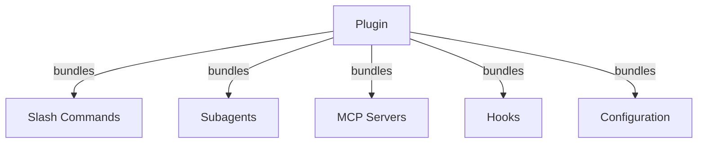
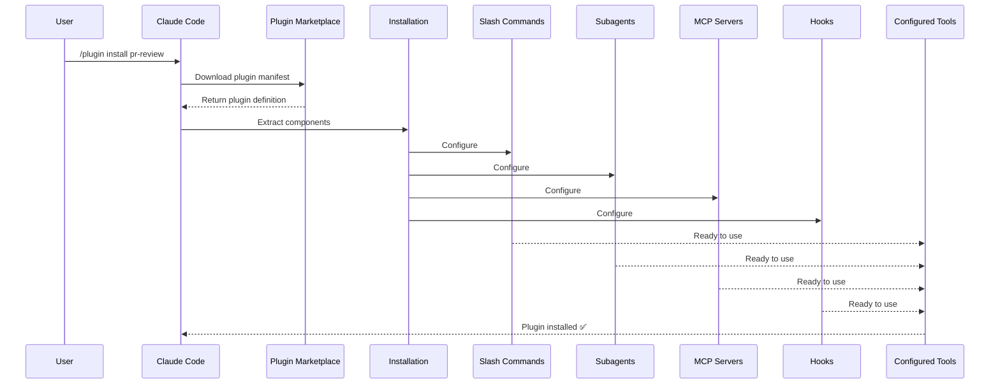
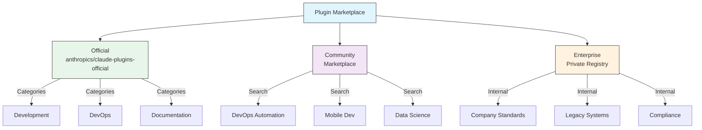
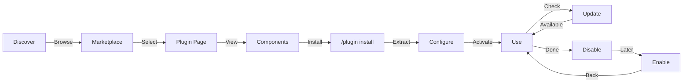
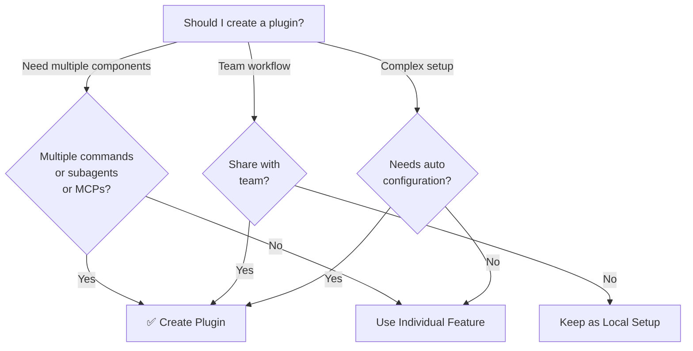

<picture>
  <source media="(prefers-color-scheme: dark)" srcset="../resources/logos/claude-howto-logo-dark.svg">
  
</picture>

# Claude Code 插件

本文件夹包含完整的插件示例，将多个 Claude Code 功能打包成统一的、可安装的包。

## 概述

Claude Code 插件是自定义功能的打包集合（斜杠命令、子代理、MCP 服务器和钩子），可通过单个命令安装。它们代表了最高级别的扩展机制——将多个功能组合成统一的、可共享的包。

## 插件架构



## 插件加载流程



## 插件类型与分发

| 类型 | 范围 | 共享范围 | 权限 | 示例 |
|------|-------|--------|-----------|----------|
| 官方 | 全局 | 所有用户 | Anthropic | PR 审查、安全指南 |
| 社区 | 公开 | 所有用户 | 社区 | DevOps、数据科学 |
| 组织 | 内部 | 团队成员 | 公司 | 内部标准、工具 |
| 个人 | 个人 | 单个用户 | 开发者 | 自定义工作流 |

## 插件定义结构

插件清单使用 JSON 格式，位于 `.claude-plugin/plugin.json`：

```json
{
  "name": "my-first-plugin",
  "description": "A greeting plugin",
  "version": "1.0.0",
  "author": {
    "name": "Your Name"
  },
  "homepage": "https://example.com",
  "repository": "https://github.com/user/repo",
  "license": "MIT"
}
```

## 插件结构示例

```
my-plugin/
├── .claude-plugin/
│   └── plugin.json       # 清单（名称、描述、版本、作者）
├── commands/             # 以 Markdown 文件形式的技能
│   ├── task-1.md
│   ├── task-2.md
│   └── workflows/
├── agents/               # 自定义代理定义
│   ├── specialist-1.md
│   ├── specialist-2.md
│   └── configs/
├── skills/               # 带有 SKILL.md 文件的代理技能
│   ├── skill-1.md
│   └── skill-2.md
├── hooks/                # hooks.json 中的事件处理器
│   └── hooks.json
├── .mcp.json             # MCP 服务器配置
├── .lsp.json             # 用于代码智能的 LSP 服务器配置
├── bin/                  # 插件启用时添加到 Bash 工具 PATH 的可执行文件
├── settings.json         # 插件启用时应用的默认设置（目前仅支持 `agent` 键）
├── themes/               # 可选：附带自定义 Claude Code 主题（v2.1.118+）
├── templates/
│   └── issue-template.md
├── scripts/
│   ├── helper-1.sh
│   └── helper-2.py
├── docs/
│   ├── README.md
│   └── USAGE.md
└── tests/
    └── plugin.test.js
```

### LSP 服务器配置

插件可以包含语言服务器协议（LSP）支持，提供实时代码智能。LSP 服务器在你工作时提供诊断、代码导航和符号信息。

**配置位置**：
- 插件根目录中的 `.lsp.json` 文件
- `plugin.json` 中的内联 `lsp` 键

#### 字段参考

| 字段 | 必填 | 描述 |
|-------|----------|-------------|
| `command` | 是 | LSP 服务器二进制文件（必须在 PATH 中） |
| `extensionToLanguage` | 是 | 将文件扩展名映射到语言 ID |
| `args` | 否 | 服务器的命令行参数 |
| `transport` | 否 | 通信方式：`stdio`（默认）或 `socket` |
| `env` | 否 | 服务器进程的环境变量 |
| `initializationOptions` | 否 | LSP 初始化时发送的选项 |
| `settings` | 否 | 传递给服务器的工作区配置 |
| `workspaceFolder` | 否 | 覆盖工作区文件夹路径 |
| `startupTimeout` | 否 | 等待服务器启动的最大时间（毫秒） |
| `shutdownTimeout` | 否 | 优雅关闭的最大时间（毫秒） |
| `restartOnCrash` | 否 | 服务器崩溃时自动重启 |
| `maxRestarts` | 否 | 放弃前的最大重启尝试次数 |

#### 配置示例

**Go (gopls)**：

```json
{
  "go": {
    "command": "gopls",
    "args": ["serve"],
    "extensionToLanguage": {
      ".go": "go"
    }
  }
}
```

**Python (pyright)**：

```json
{
  "python": {
    "command": "pyright-langserver",
    "args": ["--stdio"],
    "extensionToLanguage": {
      ".py": "python",
      ".pyi": "python"
    }
  }
}
```

**TypeScript**：

```json
{
  "typescript": {
    "command": "typescript-language-server",
    "args": ["--stdio"],
    "extensionToLanguage": {
      ".ts": "typescript",
      ".tsx": "typescriptreact",
      ".js": "javascript",
      ".jsx": "javascriptreact"
    }
  }
}
```

#### 可用的 LSP 插件

官方市场包含预配置的 LSP 插件：

| 插件 | 语言 | 服务器二进制文件 | 安装命令 |
|--------|----------|---------------|----------------|
| `pyright-lsp` | Python | `pyright-langserver` | `pip install pyright` |
| `typescript-lsp` | TypeScript/JavaScript | `typescript-language-server` | `npm install -g typescript-language-server typescript` |
| `rust-lsp` | Rust | `rust-analyzer` | Install via `rustup component add rust-analyzer` |

#### LSP 能力

配置完成后，LSP 服务器提供：

- **即时诊断** — 编辑后立即显示错误和警告
- **代码导航** — 跳转到定义、查找引用、实现
- **悬停信息** — 悬停时显示类型签名和文档
- **符号列表** — 浏览当前文件或工作区中的符号

## 插件选项（v2.1.83+）

插件可以在清单中通过 `userConfig` 声明用户可配置的选项。标记为 `sensitive: true` 的值存储在系统密钥链中，而不是纯文本设置文件中：

```json
{
  "name": "my-plugin",
  "version": "1.0.0",
  "userConfig": {
    "apiKey": {
      "description": "API key for the service",
      "sensitive": true
    },
    "region": {
      "description": "Deployment region",
      "default": "us-east-1"
    }
  }
}
```

## 持久化插件数据（`${CLAUDE_PLUGIN_DATA}`）（v2.1.78+）

插件可以通过 `${CLAUDE_PLUGIN_DATA}` 环境变量访问持久化状态目录。该目录对每个插件唯一，并在会话之间保留，适用于缓存、数据库和其他持久化状态：

```json
{
  "hooks": {
    "PostToolUse": [
      {
        "command": "node ${CLAUDE_PLUGIN_DATA}/track-usage.js"
      }
    ]
  }
}
```

该目录在插件安装时自动创建。存储在此处的文件在插件卸载之前一直保留。

### 后台监控器（v2.1.105）

插件可以注册后台监控器，在会话开始时或插件技能被调用时自动激活。在插件清单中添加顶级 `monitors` 键：

```json
{
  "name": "my-plugin",
  "version": "1.0.0",
  "monitors": [
    {
      "command": "tail -f /var/log/app.log",
      "trigger": "session_start"
    }
  ]
}
```

`trigger` 字段接受：
- `"session_start"` — 会话开始时自动激活监控器
- `"skill_invoke"` — 插件技能被调用时激活监控器

监控器在底层使用相同的 Monitor 工具，将 stdout 行作为事件流传输，供 Claude 做出响应。

## 通过设置内联插件（`source: 'settings'`）（v2.1.80+）

插件可以在设置文件中作为市场条目内联定义，使用 `source: 'settings'` 字段。这允许直接嵌入插件定义，无需单独的仓库或市场：

```json
{
  "pluginMarketplaces": [
    {
      "name": "inline-tools",
      "source": "settings",
      "plugins": [
        {
          "name": "quick-lint",
          "source": "./local-plugins/quick-lint"
        }
      ]
    }
  ]
}
```

## 插件设置

插件可以附带 `settings.json` 文件以提供默认配置。目前支持 `agent` 键，用于设置插件的主线程代理：

```json
{
  "agent": "agents/specialist-1.md"
}
```

当插件包含 `settings.json` 时，其默认值在安装时应用。用户可以在自己的项目或用户配置中覆盖这些设置。

## 独立方式 vs 插件方式

| 方式 | 命令名称 | 配置 | 最适合 |
|----------|---------------|---|---|
| **独立** | `/hello` | 在 CLAUDE.md 中手动设置 | 个人、项目特定 |
| **插件** | `/plugin-name:hello` | 通过 plugin.json 自动化 | 共享、分发、团队使用 |

对于快速的个人工作流使用**独立斜杠命令**。当你想要打包多个功能、与团队共享或发布分发时使用**插件**。

## 实用示例

### 示例 1：PR 审查插件

**File:** `.claude-plugin/plugin.json`

```json
{
  "name": "pr-review",
  "version": "1.0.0",
  "description": "Complete PR review workflow with security, testing, and docs",
  "author": {
    "name": "Anthropic"
  },
  "repository": "https://github.com/your-org/pr-review",
  "license": "MIT"
}
```

**File:** `commands/review-pr.md`

```markdown
---
name: Review PR
description: Start comprehensive PR review with security and testing checks
---

# PR Review

This command initiates a complete pull request review including:

1. Security analysis
2. Test coverage verification
3. Documentation updates
4. Code quality checks
5. Performance impact assessment
```

**File:** `agents/security-reviewer.md`

```yaml
---
name: security-reviewer
description: Security-focused code review
tools: read, grep, diff
---

# Security Reviewer

Specializes in finding security vulnerabilities:
- Authentication/authorization issues
- Data exposure
- Injection attacks
- Secure configuration
```

**安装：**

```bash
/plugin install pr-review

# Result:
# ✅ 3 slash commands installed
# ✅ 3 subagents configured
# ✅ 2 MCP servers connected
# ✅ 4 hooks registered
# ✅ Ready to use!
```

### 示例 2：DevOps 插件

**组件：**

```
devops-automation/
├── commands/
│   ├── deploy.md
│   ├── rollback.md
│   ├── status.md
│   └── incident.md
├── agents/
│   ├── deployment-specialist.md
│   ├── incident-commander.md
│   └── alert-analyzer.md
├── mcp/
│   ├── github-config.json
│   ├── kubernetes-config.json
│   └── prometheus-config.json
├── hooks/
│   ├── pre-deploy.js
│   ├── post-deploy.js
│   └── on-error.js
└── scripts/
    ├── deploy.sh
    ├── rollback.sh
    └── health-check.sh
```

### 示例 3：文档插件

**打包组件：**

```
documentation/
├── commands/
│   ├── generate-api-docs.md
│   ├── generate-readme.md
│   ├── sync-docs.md
│   └── validate-docs.md
├── agents/
│   ├── api-documenter.md
│   ├── code-commentator.md
│   └── example-generator.md
├── mcp/
│   ├── github-docs-config.json
│   └── slack-announce-config.json
└── templates/
    ├── api-endpoint.md
    ├── function-docs.md
    └── adr-template.md
```

## 插件市场

官方 Anthropic 管理的插件目录是 `anthropics/claude-plugins-official`。企业管理员也可以创建私有插件市场用于内部分发。



### 市场配置

企业和高级用户可以通过设置控制市场行为：

| 设置 | 描述 |
|---------|-------------|
| `extraKnownMarketplaces` | 在默认值之外添加额外的市场来源 |
| `strictKnownMarketplaces` | 控制用户可以添加哪些市场（仅限管理） |
| `blockedMarketplaces` | 管理员管理的市场黑名单（自 v2.1.119 起支持 `hostPattern` / `pathPattern` 正则表达式字段） |
| `deniedPlugins` | 管理员管理的黑名单，防止安装特定插件 |

> **强制执行**（v2.1.117+）：`blockedMarketplaces` 和 `strictKnownMarketplaces` 在每个插件生命周期事件上强制执行——安装、更新、刷新和自动更新——而不仅仅是首次添加时。`strictKnownMarketplaces` 仅限管理。

`blockedMarketplaces` 使用主机/路径正则表达式的示例（v2.1.119）：

```json
{
  "blockedMarketplaces": [
    {
      "hostPattern": "^evil\\.example\\.com$",
      "pathPattern": "^/marketplaces/.*"
    }
  ]
}
```

### 额外的市场功能

- **默认 git 超时**：从 30 秒增加到 120 秒，适用于大型插件仓库
- **自定义 npm 注册表**：插件可以指定自定义 npm 注册表 URL 用于依赖解析
- **版本锁定**：将插件锁定到特定版本，实现可复现的环境

### 市场定义模式

插件市场在 `.claude-plugin/marketplace.json` 中定义：

```json
{
  "name": "my-team-plugins",
  "owner": "my-org",
  "plugins": [
    {
      "name": "code-standards",
      "source": "./plugins/code-standards",
      "description": "Enforce team coding standards",
      "version": "1.2.0",
      "author": "platform-team"
    },
    {
      "name": "deploy-helper",
      "source": {
        "source": "github",
        "repo": "my-org/deploy-helper",
        "ref": "v2.0.0"
      },
      "description": "Deployment automation workflows"
    }
  ]
}
```

| 字段 | 必填 | 描述 |
|-------|----------|-------------|
| `name` | 是 | 市场名称，使用 kebab-case |
| `owner` | 是 | 维护市场的组织或用户 |
| `plugins` | 是 | 插件条目数组 |
| `plugins[].name` | 是 | 插件名称（kebab-case） |
| `plugins[].source` | 是 | 插件来源（路径字符串或来源对象） |
| `plugins[].description` | 否 | 简要的插件描述 |
| `plugins[].version` | 否 | 语义化版本字符串 |
| `plugins[].author` | 否 | 插件作者名称 |

### 插件来源类型

插件可以从多个位置获取：

| 来源 | 语法 | 示例 |
|--------|--------|---------|
| **相对路径** | 字符串路径 | `"./plugins/my-plugin"` |
| **GitHub** | `{ "source": "github", "repo": "owner/repo" }` | `{ "source": "github", "repo": "acme/lint-plugin", "ref": "v1.0" }` |
| **Git URL** | `{ "source": "url", "url": "..." }` | `{ "source": "url", "url": "https://git.internal/plugin.git" }` |
| **Git 子目录** | `{ "source": "git-subdir", "url": "...", "path": "..." }` | `{ "source": "git-subdir", "url": "https://github.com/org/monorepo.git", "path": "packages/plugin" }` |
| **npm** | `{ "source": "npm", "package": "..." }` | `{ "source": "npm", "package": "@acme/claude-plugin", "version": "^2.0" }` |
| **pip** | `{ "source": "pip", "package": "..." }` | `{ "source": "pip", "package": "claude-data-plugin", "version": ">=1.0" }` |

GitHub 和 git 来源支持可选的 `ref`（分支/标签）和 `sha`（提交哈希）字段用于版本锁定。

### 分发方法

**GitHub（推荐）**：
```bash
# 用户添加你的市场
/plugin marketplace add owner/repo-name
```

**其他 git 服务**（需要完整 URL）：
```bash
/plugin marketplace add https://gitlab.com/org/marketplace-repo.git
```

**私有仓库**：通过 git 凭证助手或环境令牌支持。用户必须拥有对仓库的读取权限。

**官方市场提交**：通过 [claude.ai/settings/plugins/submit](https://claude.ai/settings/plugins/submit) 或 [platform.claude.com/plugins/submit](https://platform.claude.com/plugins/submit) 将插件提交到 Anthropic 策划的市场以进行更广泛的分发。

### 管理市场

```bash
# 市场 CLI 命令
claude plugin marketplace add <source>       # 添加市场（GitHub、URL、本地）
claude plugin marketplace update [name]      # 刷新目录索引
claude plugin marketplace remove <name>      # 移除市场
claude plugin marketplace list               # 列出已配置的市场
```

> **重要**：`marketplace update` 仅刷新插件目录（可安装的内容）。它**不会**更新已安装的插件。使用 `plugin update <name>` 来更新特定已安装的插件。

### 严格模式

控制市场定义如何与本地 `plugin.json` 文件交互：

| 设置 | 行为 |
|---------|----------|
| `strict: true`（默认） | 本地 `plugin.json` 为权威来源；市场条目对其进行补充 |
| `strict: false` | 市场条目就是完整的插件定义 |

**使用 `strictKnownMarketplaces` 的组织限制**：

| 值 | 效果 |
|-------|--------|
| 未设置 | 无限制——用户可以添加任何市场 |
| 空数组 `[]` | 锁定——不允许任何市场 |
| 模式数组 | 白名单——只允许匹配的市场 |

```json
{
  "strictKnownMarketplaces": [
    "my-org/*",
    "github.com/trusted-vendor/*"
  ]
}
```

> **警告**：在使用 `strictKnownMarketplaces` 的严格模式下，用户只能从白名单市场安装插件。这对于需要控制插件分发的企业环境非常有用。

## 插件安装与生命周期



## 插件功能对比

| 功能 | 斜杠命令 | 技能 | 子代理 | 插件 |
|---------|---------------|-------|----------|--------|
| **安装** | 手动复制 | 手动复制 | 手动配置 | 一条命令 |
| **设置时间** | 5 分钟 | 10 分钟 | 15 分钟 | 2 分钟 |
| **打包** | 单个文件 | 单个文件 | 单个文件 | 多个 |
| **版本管理** | 手动 | 手动 | 手动 | 自动 |
| **团队共享** | 复制文件 | 复制文件 | 复制文件 | 安装 ID |
| **更新** | 手动 | 手动 | 手动 | 自动可用 |
| **依赖** | 无 | 无 | 无 | 可能包含 |
| **市场** | 否 | 否 | 否 | 是 |
| **分发** | 仓库 | 仓库 | 仓库 | 市场 |

## 插件 CLI 命令

所有插件操作都可作为 CLI 命令使用：

```bash
claude plugin install <name>@<marketplace>   # 从市场安装
claude plugin uninstall <name>               # 移除插件
claude plugin update <name>                  # 将已安装的插件更新到最新版本
claude plugin list                           # 列出已安装的插件
claude plugin enable <name>                  # 启用已禁用的插件
claude plugin disable <name>                 # 禁用插件
claude plugin validate                       # 验证插件结构
claude plugin tag <version>                  # 创建带有版本验证的发布 git 标签（v2.1.118+）
```

示例：`claude plugin tag v0.3.0` 验证版本格式，创建匹配的 git 标签，是发布插件进行分发的推荐方式。

## 安装方法

### 从市场安装
```bash
/plugin install plugin-name
# 或从 CLI：
claude plugin install plugin-name@marketplace-name
```

### 启用/禁用（自动检测范围）
```bash
/plugin enable plugin-name
/plugin disable plugin-name
```

### 本地插件（用于开发）
```bash
# 用于本地测试的 CLI 标志（可重复用于多个插件）
claude --plugin-dir ./path/to/plugin
claude --plugin-dir ./plugin-a --plugin-dir ./plugin-b
```

### 从 Git 仓库安装
```bash
/plugin install github:username/repo
```

## 自动更新

Claude Code 可以在启动时自动更新市场及其已安装的插件。

| 市场类型 | 默认自动更新 | 如何切换 |
|------------------|---------------------|---------------|
| 官方（`claude-plugins-official`） | ✅ 已启用 | `/plugin` → Marketplaces → Select |
| 第三方/本地 | ❌ 已禁用 | 相同的 UI 路径 |

自动更新运行时，Claude Code 会：
1. 刷新市场目录
2. 将已安装的插件更新到最新版本
3. 显示通知提示 `/reload-plugins`

### 环境变量

| 变量 | 效果 |
|----------|--------|
| `DISABLE_AUTOUPDATER=1` | 禁用所有自动更新（Claude Code + 插件） |
| `DISABLE_AUTOUPDATER=1` + `FORCE_AUTOUPDATE_PLUGINS=1` | 保留插件更新，禁用 Claude Code 更新 |

```bash
# 禁用所有自动更新
export DISABLE_AUTOUPDATER=1

# 仅保留插件自动更新
export DISABLE_AUTOUPDATER=1
export FORCE_AUTOUPDATE_PLUGINS=1
```

## 何时创建插件



### 插件使用场景

| 使用场景 | 建议 | 原因 |
|----------|-----------------|-----|
| **团队入职** | ✅ 使用插件 | 即时设置，所有配置 |
| **框架设置** | ✅ 使用插件 | 打包特定于框架的命令 |
| **企业标准** | ✅ 使用插件 | 集中分发，版本控制 |
| **快速任务自动化** | ❌ 使用命令 | 过于复杂 |
| **单一领域专长** | ❌ 使用技能 | 太重，应使用技能 |
| **专业分析** | ❌ 使用子代理 | 手动创建或使用技能 |
| **实时数据访问** | ❌ 使用 MCP | 独立使用，不要打包 |

## 测试插件

发布前，使用 `--plugin-dir` CLI 标志在本地测试插件（可重复用于多个插件）：

```bash
claude --plugin-dir ./my-plugin
claude --plugin-dir ./my-plugin --plugin-dir ./another-plugin
```

这会加载你的插件启动 Claude Code，让你可以：
- 验证所有斜杠命令可用
- 测试子代理和代理功能正确
- 确认 MCP 服务器正确连接
- 验证钩子执行
- 检查 LSP 服务器配置
- 检查是否有任何配置错误

## 热重载

插件在开发期间支持热重载。当你修改插件文件时，Claude Code 可以自动检测变更。你也可以通过以下命令强制重载：

```bash
/reload-plugins
```

这会重新读取所有插件清单、命令、代理、技能、钩子和 MCP/LSP 配置，无需重启会话。

## 插件的管理设置

管理员可以使用管理设置在整个组织范围内控制插件行为：

| 设置 | 描述 |
|---------|-------------|
| `enabledPlugins` | 默认启用的插件白名单 |
| `deniedPlugins` | 不能安装的插件黑名单 |
| `extraKnownMarketplaces` | 在默认值之外添加额外的市场来源 |
| `strictKnownMarketplaces` | 限制用户可以添加哪些市场（仅限管理；自 v2.1.117 起在每个插件生命周期事件上强制执行） |
| `blockedMarketplaces` | 市场黑名单；自 v2.1.117 起在每个插件生命周期事件上强制执行；自 v2.1.119 起支持 `hostPattern` / `pathPattern` 正则表达式字段 |
| `allowedChannelPlugins` | 控制每个发布渠道允许的插件 |

这些设置可以通过管理配置文件在组织级别应用，并优先于用户级别的设置。

## 插件安全

插件子代理在受限沙箱中运行。以下 frontmatter 键在插件子代理定义中**不允许**使用：

- `hooks` -- 子代理不能注册事件处理器
- `mcpServers` -- 子代理不能配置 MCP 服务器
- `permissionMode` -- 子代理不能覆盖权限模型

这确保插件不能提升权限或超出其声明的范围修改主机环境。

## 发布插件

**发布步骤：**

1. 创建包含所有组件的插件结构
2. 编写 `.claude-plugin/plugin.json` 清单
3. 创建包含文档的 `README.md`
4. 使用 `claude --plugin-dir ./my-plugin` 在本地测试
5. 使用 `claude plugin tag v0.3.0` 标记发布版本（v2.1.118+）——验证版本字符串并创建匹配的 git 标签
6. 提交到插件市场
7. 接受审查和批准
8. 在市场上发布
9. 用户可以通过一条命令安装

**提交示例：**

```markdown
# PR Review Plugin

## Description
Complete PR review workflow with security, testing, and documentation checks.

## What's Included
- 3 slash commands for different review types
- 3 specialized subagents
- GitHub and CodeQL MCP integration
- Automated security scanning hooks

## Installation
```bash
/plugin install pr-review
```

## Features
✅ Security analysis
✅ Test coverage checking
✅ Documentation verification
✅ Code quality assessment
✅ Performance impact analysis

## Usage
```bash
/review-pr
/check-security
/check-tests
```

## Requirements
- Claude Code 1.0+
- GitHub access
- CodeQL (optional)
```

## 插件 vs 手动配置

**手动设置（2+ 小时）：**
- 逐个安装斜杠命令
- 单独创建子代理
- 分别配置 MCP
- 手动设置钩子
- 记录所有内容
- 与团队共享（希望他们配置正确）

**使用插件（2 分钟）：**
```bash
/plugin install pr-review
# ✅ Everything installed and configured
# ✅ Ready to use immediately
# ✅ Team can reproduce exact setup
```

## 最佳实践

### 应该做 ✅
- 使用清晰、描述性的插件名称
- 包含全面的 README
- 正确地对插件进行版本管理（semver）
- 一起测试所有组件
- 清楚地记录系统要求
- 提供使用示例
- 包含错误处理
- 适当地标记以便于发现
- 保持向后兼容性
- 保持插件专注且内聚
- 包含全面的测试
- 记录所有依赖

### 不应该做 ❌
- 不要打包不相关的功能
- 不要硬编码凭证
- 不要跳过测试
- 不要忘记文档
- 不要创建冗余的插件
- 不要忽视版本管理
- 不要过度复杂化组件依赖
- 不要忘记优雅地处理错误

## 安装说明

### 从市场安装

1. **浏览可用插件：**
   ```bash
   /plugin list
   ```

2. **查看插件详情：**
   ```bash
   /plugin info plugin-name
   ```

3. **安装插件：**
   ```bash
   /plugin install plugin-name
   ```

### 从本地路径安装

```bash
/plugin install ./path/to/plugin-directory
```

### 从 GitHub 安装

```bash
/plugin install github:username/repo
```

### 列出已安装的插件

```bash
/plugin list --installed
```

### 更新插件

```bash
/plugin update plugin-name
```

### 禁用/启用插件

```bash
# 临时禁用
/plugin disable plugin-name

# 重新启用
/plugin enable plugin-name
```

### 卸载插件

```bash
/plugin uninstall plugin-name
```

## 相关概念

以下 Claude Code 功能与插件协同工作：

- **[斜杠命令](../01-slash-commands/)** - 打包在插件中的单独命令
- **[记忆](../02-memory/)** - 插件的持久化上下文
- **[技能](../03-skills/)** - 可以包装成插件的领域专长
- **[子代理](../04-subagents/)** - 作为插件组件包含的专业代理
- **[MCP 服务器](../05-mcp/)** - 打包在插件中的模型上下文协议集成
- **[钩子](../06-hooks/)** - 触发插件工作流的事件处理器

## 完整工作流示例

### PR 审查插件完整工作流

```
1. User: /review-pr

2. Plugin executes:
   ├── pre-review.js hook validates git repo
   ├── GitHub MCP fetches PR data
   ├── security-reviewer subagent analyzes security
   ├── test-checker subagent verifies coverage
   └── performance-analyzer subagent checks performance

3. Results synthesized and presented:
   ✅ Security: No critical issues
   ⚠️  Testing: Coverage 65% (recommend 80%+)
   ✅ Performance: No significant impact
   📝 12 recommendations provided
```

## 故障排除

### 插件无法安装
- 检查 Claude Code 版本兼容性：`/version`
- 使用 JSON 验证器验证 `plugin.json` 语法
- 检查网络连接（对于远程插件）
- 检查权限：`ls -la plugin/`

### 组件未加载
- 验证 `plugin.json` 中的路径与实际目录结构匹配
- 检查文件权限：`chmod +x scripts/`
- 检查组件文件语法
- 查看日志：`/plugin debug plugin-name`

### MCP 连接失败
- 验证环境变量设置正确
- 检查 MCP 服务器安装和健康状态
- 使用 `/mcp test` 独立测试 MCP 连接
- 检查 `mcp/` 目录中的 MCP 配置

### 安装后命令不可用
- 确保插件安装成功：`/plugin list --installed`
- 检查插件是否已启用：`/plugin status plugin-name`
- 重启 Claude Code：`exit` 后重新打开
- 检查是否与现有命令存在命名冲突

### 钩子执行问题
- 验证钩子文件具有正确的权限
- 检查钩子语法和事件名称
- 查看钩子日志以获取错误详情
- 如果可能，手动测试钩子

## 额外资源

- [Official Plugins Documentation](https://code.claude.com/docs/en/plugins)
- [Discover Plugins](https://code.claude.com/docs/en/discover-plugins)
- [Plugin Marketplaces](https://code.claude.com/docs/en/plugin-marketplaces)
- [Plugins Reference](https://code.claude.com/docs/en/plugins-reference)
- [MCP Server Reference](https://modelcontextprotocol.io/)
- [Subagent Configuration Guide](../04-subagents/README.md)
- [Hook System Reference](../06-hooks/README.md)

---

**Last Updated**: April 24, 2026
**Claude Code Version**: 2.1.119
**Sources**:
- https://code.claude.com/docs/en/plugins
- https://code.claude.com/docs/en/plugin-marketplaces
- https://github.com/anthropics/claude-code/releases/tag/v2.1.117
- https://github.com/anthropics/claude-code/releases/tag/v2.1.118
- https://github.com/anthropics/claude-code/releases/tag/v2.1.119
**Compatible Models**: Claude Sonnet 4.6, Claude Opus 4.7, Claude Haiku 4.5
