<picture>
  <source media="(prefers-color-scheme: dark)" srcset="resources/logos/claude-howto-logo-dark.svg">
  
</picture>

# 📚 Claude Code 学习路线图

**刚接触 Claude Code？** 本指南帮助你按照自己的节奏掌握 Claude Code 功能。无论你是完全的初学者还是经验丰富的开发者，请先完成下方的自我评估测验，找到适合你的学习路径。

---

## 🧭 找到你的水平

每个人的起点不同。完成这个快速自我评估，找到合适的入口。

**请如实回答以下问题：**

- [ ] 我能够启动 Claude Code 并进行对话（`claude`）
- [ ] 我创建或编辑过 CLAUDE.md 文件
- [ ] 我使用过至少 3 个内置斜杠命令（例如 /help、/compact、/model）
- [ ] 我创建过自定义斜杠命令或技能（SKILL.md）
- [ ] 我配置过 MCP 服务器（例如 GitHub、数据库）
- [ ] 我在 ~/.claude/settings.json 中设置过钩子
- [ ] 我创建或使用过自定义子代理（.claude/agents/）
- [ ] 我使用过打印模式（`claude -p`）进行脚本或 CI/CD 操作

**你的水平：**

| 勾选数 | 水平 | 起始位置 | 预计完成时间 |
|--------|------|----------|-------------|
| 0-2 | **第 1 级：初学者** — 入门 | [里程碑 1A](#里程碑-1a初识命令与记忆) | 约 3 小时 |
| 3-5 | **第 2 级：中级** — 构建工作流 | [里程碑 2A](#里程碑-2a自动化技能与钩子) | 约 5 小时 |
| 6-8 | **第 3 级：高级** — 高级用户与团队负责人 | [里程碑 3A](#里程碑-3a高级功能) | 约 5 小时 |

> **提示**：如果你不确定自己的水平，建议从低一级开始。快速回顾熟悉的内容总比遗漏基础概念要好。

> **交互版本**：在 Claude Code 中运行 `/self-assessment`，获取引导式交互测验，评估你在全部 10 个功能领域的熟练度，并生成个性化学习路径。

---

## 🎯 学习理念

本仓库中的文件夹按 **推荐学习顺序** 编号，基于三个关键原则：

1. **依赖关系** — 基础概念优先
2. **复杂度** — 简单功能先于高级功能
3. **使用频率** — 最常用的功能最先教授

这种方法确保你在建立坚实基础的同时，能立即获得生产力提升。

---

## 🗺️ 你的学习路径

```mermaid
graph TD
    Q["🧭 Self-Assessment Quiz<br/>Find Your Level"] --> L1
    Q --> L2
    Q --> L3

    subgraph L1["🟢 Level 1: Beginner — Getting Started"]
        direction LR
        A["1A: First Commands & Memory<br/>Slash Commands + Memory"] --> B["1B: Safe Exploration<br/>Checkpoints + CLI Basics"]
    end

    subgraph L2["🔵 Level 2: Intermediate — Building Workflows"]
        direction LR
        C["2A: Automation<br/>Skills + Hooks"] --> D["2B: Integration<br/>MCP + Subagents"]
    end

    subgraph L3["🔴 Level 3: Advanced — Power User"]
        direction LR
        E["3A: Advanced Features<br/>Planning + Permissions"] --> F["3B: Team & Distribution<br/>Plugins + CLI Mastery"]
    end

    L1 --> L2
    L2 --> L3

    style Q fill:#6A1B9A,color:#fff,stroke:#9C27B0,stroke-width:2px
    style A fill:#2E7D32,color:#fff
    style B fill:#2E7D32,color:#fff
    style C fill:#1565C0,color:#fff
    style D fill:#F57C00,color:#fff
    style E fill:#C62828,color:#fff
    style F fill:#B71C1C,color:#fff
```



**颜色图例：**
- 💜 紫色：自我评估测验
- 🟢 绿色：第 1 级 — 初学者路径
- 🔵 蓝色 / 🟡 金色：第 2 级 — 中级路径
- 🔴 红色：第 3 级 — 高级路径

---

## 📊 完整路线图表

| 步骤 | 功能 | 复杂度 | 时间 | 水平 | 依赖项 | 学习理由 | 关键收益 |
|------|------|--------|------|------|--------|----------|----------|
| **1** | [Slash Commands](01-slash-commands/) | ⭐ 初学者 | 30 分钟 | 第 1 级 | 无 | 快速提升生产力（55+ 内置 + 5 个捆绑技能） | 即时自动化、团队标准 |
| **2** | [Memory](02-memory/) | ⭐⭐ 初学者+ | 45 分钟 | 第 1 级 | 无 | 所有功能的基础 | 持久上下文、偏好设置 |
| **3** | [Checkpoints](08-checkpoints/) | ⭐⭐ 中级 | 45 分钟 | 第 1 级 | 会话管理 | 安全探索 | 实验、恢复 |
| **4** | [CLI 基础](10-cli/) | ⭐⭐ 初学者+ | 30 分钟 | 第 1 级 | 无 | 核心 CLI 使用 | 交互与打印模式 |
| **5** | [Skills](03-skills/) | ⭐⭐ 中级 | 1 小时 | 第 2 级 | Slash Commands | 自动化专业知识 | 可重用能力、一致性 |
| **6** | [Hooks](06-hooks/) | ⭐⭐ 中级 | 1 小时 | 第 2 级 | 工具、命令 | 工作流自动化（28 个事件、5 种类型） | 验证、质量关卡 |
| **7** | [MCP](05-mcp/) | ⭐⭐⭐ 中级+ | 1 小时 | 第 2 级 | 配置 | 实时数据访问 | 实时集成、API |
| **8** | [Subagents](04-subagents/) | ⭐⭐⭐ 中级+ | 1.5 小时 | 第 2 级 | Memory、Commands | 复杂任务处理（6 个内置，包括 Bash） | 任务委派、专业知识 |
| **9** | [Advanced Features](09-advanced-features/) | ⭐⭐⭐⭐⭐ 高级 | 2-3 小时 | 第 3 级 | 所有前置内容 | 高级用户工具 | 规划、Auto Mode、Channels、语音听写、权限 |
| **10** | [Plugins](07-plugins/) | ⭐⭐⭐⭐ 高级 | 2 小时 | 第 3 级 | 所有前置内容 | 完整解决方案 | 团队入门、分发 |
| **11** | [CLI 精通](10-cli/) | ⭐⭐⭐ 高级 | 1 小时 | 第 3 级 | 推荐：全部 | 掌握命令行用法 | 脚本、CI/CD、自动化 |

**总学习时间**：约 11-13 小时（或直接跳到你的水平以节省时间）

---

## 🟢 第 1 级：初学者 — 入门

**适用人群**：测验勾选 0-2 项的用户
**时间**：约 3 小时
**重点**：即时提升生产力，理解基本概念
**成果**：熟练的日常用户，准备进入第 2 级

### 里程碑 1A：初识命令与记忆

**主题**：Slash Commands + Memory
**时间**：1-2 小时
**复杂度**：⭐ 初学者
**目标**：通过自定义命令和持久上下文快速提升生产力

#### 你将收获
✅ 为重复性任务创建自定义斜杠命令
✅ 为团队标准设置项目记忆
✅ 配置个人偏好
✅ 理解 Claude 如何自动加载上下文

#### 动手练习

```bash
# 练习 1：安装你的第一个斜杠命令
mkdir -p .claude/commands
cp 01-slash-commands/optimize.md .claude/commands/

# 练习 2：创建项目记忆
cp 02-memory/project-CLAUDE.md ./CLAUDE.md

# 练习 3：试一试
# 在 Claude Code 中输入：/optimize
```

#### 成功标准
- [ ] 成功调用 `/optimize` 命令
- [ ] Claude 能从 CLAUDE.md 中记住你的项目标准
- [ ] 理解何时使用斜杠命令、何时使用记忆

#### 后续步骤
熟练后，请阅读：
- [01-slash-commands/README.md](01-slash-commands/README.md)
- [02-memory/README.md](02-memory/README.md)

> **检验你的理解**：在 Claude Code 中运行 `/lesson-quiz slash-commands` 或 `/lesson-quiz memory` 来测试所学内容。

---

### 里程碑 1B：安全探索

**主题**：Checkpoints + CLI 基础
**时间**：1 小时
**复杂度**：⭐⭐ 初学者+
**目标**：学会安全地实验，掌握核心 CLI 命令

#### 你将收获
✅ 创建和恢复检查点，安全地进行实验
✅ 理解交互模式与打印模式的区别
✅ 使用基本的 CLI 标志和选项
✅ 通过管道处理文件

#### 动手练习

```bash
# 练习 1：体验检查点工作流
# 在 Claude Code 中：
# 进行一些实验性修改，然后按 Esc+Esc 或使用 /rewind
# 选择实验之前的检查点
# 选择 "Restore code and conversation" 回到之前的状态

# 练习 2：交互模式 vs 打印模式
claude "explain this project"           # 交互模式
claude -p "explain this function"       # 打印模式（非交互）

# 练习 3：通过管道处理文件内容
cat error.log | claude -p "explain this error"
```

#### 成功标准
- [ ] 创建并恢复到一个检查点
- [ ] 使用了交互模式和打印模式
- [ ] 通过管道将文件发送给 Claude 进行分析
- [ ] 理解何时使用检查点进行安全实验

#### 后续步骤
- 阅读：[08-checkpoints/README.md](08-checkpoints/README.md)
- 阅读：[10-cli/README.md](10-cli/README.md)
- **准备进入第 2 级！** 前往 [里程碑 2A](#里程碑-2a自动化技能与钩子)

> **检验你的理解**：运行 `/lesson-quiz checkpoints` 或 `/lesson-quiz cli` 来确认你已准备好进入第 2 级。

---

## 🔵 第 2 级：中级 — 构建工作流

**适用人群**：测验勾选 3-5 项的用户
**时间**：约 5 小时
**重点**：自动化、集成、任务委派
**成果**：自动化工作流、外部集成，准备进入第 3 级

### 前置知识检查

在开始第 2 级之前，请确保你已掌握以下第 1 级概念：

- [ ] 能够创建和使用斜杠命令（[01-slash-commands/](01-slash-commands/)）
- [ ] 已通过 CLAUDE.md 设置项目记忆（[02-memory/](02-memory/)）
- [ ] 知道如何创建和恢复检查点（[08-checkpoints/](08-checkpoints/)）
- [ ] 能够从命令行使用 `claude` 和 `claude -p`（[10-cli/](10-cli/)）

> **有薄弱环节？** 请先回顾上方链接的教程再继续。

---

### 里程碑 2A：自动化（技能与钩子）

**主题**：Skills + Hooks
**时间**：2-3 小时
**复杂度**：⭐⭐ 中级
**目标**：自动化常见工作流和质量检查

#### 你将收获
✅ 通过 YAML 前置元数据自动调用专业能力（包括 `effort` 和 `shell` 字段）
✅ 在 28 个钩子事件中设置事件驱动自动化
✅ 使用全部 5 种钩子类型（command、http、mcp_tool、prompt、agent）
✅ 强制执行代码质量标准
✅ 为你的工作流创建自定义钩子

#### 动手练习

```bash
# 练习 1：安装一个技能
cp -r 03-skills/code-review ~/.claude/skills/

# 练习 2：设置钩子
mkdir -p ~/.claude/hooks
cp 06-hooks/pre-tool-check.sh ~/.claude/hooks/
chmod +x ~/.claude/hooks/pre-tool-check.sh

# 练习 3：在设置中配置钩子
# 添加到 ~/.claude/settings.json：
{
  "hooks": {
    "PreToolUse": [
      {
        "matcher": "Bash",
        "hooks": [
          {
            "type": "command",
            "command": "~/.claude/hooks/pre-tool-check.sh"
          }
        ]
      }
    ]
  }
}
```

#### 成功标准
- [ ] 代码审查技能在相关场景中自动调用
- [ ] PreToolUse 钩子在工具执行前运行
- [ ] 理解技能自动调用与钩子事件触发的区别

#### 后续步骤
- 创建你自己的自定义技能
- 为你的工作流设置更多钩子
- 阅读：[03-skills/README.md](03-skills/README.md)
- 阅读：[06-hooks/README.md](06-hooks/README.md)

> **检验你的理解**：运行 `/lesson-quiz skills` 或 `/lesson-quiz hooks` 来测试你的知识，然后再继续。

---

### 里程碑 2B：集成（MCP 与子代理）

**主题**：MCP + Subagents
**时间**：2-3 小时
**复杂度**：⭐⭐⭐ 中级+
**目标**：集成外部服务并委派复杂任务

#### 你将收获
✅ 从 GitHub、数据库等获取实时数据
✅ 将工作委派给专业 AI 代理
✅ 理解何时使用 MCP、何时使用子代理
✅ 构建集成工作流

#### 动手练习

```bash
# 练习 1：设置 GitHub MCP
export GITHUB_TOKEN="your_github_token"
claude mcp add github -- npx -y @modelcontextprotocol/server-github

# 练习 2：测试 MCP 集成
# 在 Claude Code 中：/mcp__github__list_prs

# 练习 3：安装子代理
mkdir -p .claude/agents
cp 04-subagents/*.md .claude/agents/
```

#### 集成练习
尝试完成这个完整工作流：
1. 使用 MCP 获取 GitHub PR
2. 让 Claude 将审查工作委派给 code-reviewer 子代理
3. 使用钩子自动运行测试

#### 成功标准
- [ ] 成功通过 MCP 查询 GitHub 数据
- [ ] Claude 将复杂任务委派给子代理
- [ ] 理解 MCP 和子代理的区别
- [ ] 在一个工作流中组合使用了 MCP + 子代理 + 钩子

#### 后续步骤
- 设置更多 MCP 服务器（数据库、Slack 等）
- 为你的领域创建自定义子代理
- 阅读：[05-mcp/README.md](05-mcp/README.md)
- 阅读：[04-subagents/README.md](04-subagents/README.md)
- **准备进入第 3 级！** 前往 [里程碑 3A](#里程碑-3a高级功能)

> **检验你的理解**：运行 `/lesson-quiz mcp` 或 `/lesson-quiz subagents` 来确认你已准备好进入第 3 级。

---

## 🔴 第 3 级：高级 — 高级用户与团队负责人

**适用人群**：测验勾选 6-8 项的用户
**时间**：约 5 小时
**重点**：团队工具、CI/CD、企业功能、插件开发
**成果**：高级用户，能够设置团队工作流和 CI/CD

### 前置知识检查

在开始第 3 级之前，请确保你已掌握以下第 2 级概念：

- [ ] 能够创建和使用带自动调用的技能（[03-skills/](03-skills/)）
- [ ] 已设置事件驱动自动化的钩子（[06-hooks/](06-hooks/)）
- [ ] 能够配置 MCP 服务器获取外部数据（[05-mcp/](05-mcp/)）
- [ ] 知道如何使用子代理进行任务委派（[04-subagents/](04-subagents/)）

> **有薄弱环节？** 请先回顾上方链接的教程再继续。

---

### 里程碑 3A：高级功能

**主题**：Advanced Features（规划、权限、扩展思考、Auto Mode、Channels、语音听写、远程/桌面/Web）
**时间**：2-3 小时
**复杂度**：⭐⭐⭐⭐⭐ 高级
**目标**：掌握高级工作流和高级用户工具

#### 你将收获
✅ 使用规划模式处理复杂功能
✅ 细粒度权限控制，6 种模式（default、acceptEdits、plan、auto、dontAsk、bypassPermissions）
✅ 通过 Alt+T / Option+T 切换扩展思考
✅ 后台任务管理
✅ Auto Memory 自动学习偏好
✅ Auto Mode 配合后台安全分类器
✅ Channels 用于结构化多会话工作流
✅ 语音听写实现免手操作交互
✅ 远程控制、桌面应用和 Web 会话
✅ Agent Teams 多代理协作

#### 动手练习

```bash
# 练习 1：使用规划模式
/plan Implement user authentication system

# 练习 2：尝试权限模式（6 种可用：default、acceptEdits、plan、auto、dontAsk、bypassPermissions）
claude --permission-mode plan "analyze this codebase"
claude --permission-mode acceptEdits "refactor the auth module"
claude --permission-mode auto "implement the feature"

# 练习 3：启用扩展思考
# 在会话中按 Alt+T（macOS 上为 Option+T）来切换

# 练习 4：高级检查点工作流
# 1. 创建检查点 "Clean state"
# 2. 使用规划模式设计功能
# 3. 通过子代理委派实现
# 4. 在后台运行测试
# 5. 如果测试失败，回退到检查点
# 6. 尝试替代方案

# 练习 5：尝试 auto 模式（后台安全分类器）
claude --permission-mode auto "implement user settings page"

# 练习 6：启用 Agent Teams
export CLAUDE_AGENT_TEAMS=1
# 要求 Claude："Implement feature X using a team approach"

# 练习 7：定时任务
/loop 5m /check-status
# 或使用 CronCreate 创建持久化定时任务

# 练习 8：使用 Channels 进行多会话工作流
# 使用 channels 跨会话组织工作

# 练习 9：语音听写
# 使用语音输入与 Claude Code 进行免手操作交互
```

#### 成功标准
- [ ] 使用规划模式完成了复杂功能
- [ ] 配置了权限模式（plan、acceptEdits、auto、dontAsk）
- [ ] 通过 Alt+T / Option+T 切换了扩展思考
- [ ] 使用了带后台安全分类器的 auto 模式
- [ ] 使用后台任务处理长时间操作
- [ ] 探索了 Channels 多会话工作流
- [ ] 尝试了语音听写免手操作输入
- [ ] 了解远程控制、桌面应用和 Web 会话
- [ ] 启用并使用了 Agent Teams 进行协作任务
- [ ] 使用 `/loop` 进行定期任务或定时监控

#### 后续步骤
- 阅读：[09-advanced-features/README.md](09-advanced-features/README.md)

> **检验你的理解**：运行 `/lesson-quiz advanced` 来测试你对高级用户功能的掌握程度。

---

### 里程碑 3B：团队与分发（插件 + CLI 精通）

**主题**：Plugins + CLI 精通 + CI/CD
**时间**：2-3 小时
**复杂度**：⭐⭐⭐⭐ 高级
**目标**：构建团队工具、创建插件、精通 CI/CD 集成

#### 你将收获
✅ 安装和创建完整的捆绑插件
✅ 精通 CLI 脚本和自动化
✅ 使用 `claude -p` 设置 CI/CD 集成
✅ JSON 输出用于自动化流水线
✅ 会话管理和批量处理

#### 动手练习

```bash
# 练习 1：安装一个完整插件
# 在 Claude Code 中：/plugin install pr-review

# 练习 2：用于 CI/CD 的打印模式
claude -p "Run all tests and generate report"

# 练习 3：用于脚本的 JSON 输出
claude -p --output-format json "list all functions"

# 练习 4：会话管理和恢复
claude -r "feature-auth" "continue implementation"

# 练习 5：带约束的 CI/CD 集成
claude -p --max-turns 3 --output-format json "review code"

# 练习 6：批量处理
for file in *.md; do
  claude -p --output-format json "summarize this: $(cat $file)" > ${file%.md}.summary.json
done
```

#### CI/CD 集成练习
创建一个简单的 CI/CD 脚本：
1. 使用 `claude -p` 审查更改的文件
2. 以 JSON 格式输出结果
3. 用 `jq` 处理特定问题
4. 集成到 GitHub Actions 工作流中

#### 成功标准
- [ ] 安装并使用了插件
- [ ] 为团队构建或修改了插件
- [ ] 在 CI/CD 中使用了打印模式（`claude -p`）
- [ ] 生成了用于脚本的 JSON 输出
- [ ] 成功恢复了之前的会话
- [ ] 创建了批量处理脚本
- [ ] 将 Claude 集成到 CI/CD 工作流中

#### CLI 实际使用场景
- **代码审查自动化**：在 CI/CD 流水线中运行代码审查
- **日志分析**：分析错误日志和系统输出
- **文档生成**：批量生成文档
- **测试洞察**：分析测试失败原因
- **性能分析**：审查性能指标
- **数据处理**：转换和分析数据文件

#### 后续步骤
- 阅读：[07-plugins/README.md](07-plugins/README.md)
- 阅读：[10-cli/README.md](10-cli/README.md)
- 创建团队级 CLI 快捷方式和插件
- 设置批量处理脚本

> **检验你的理解**：运行 `/lesson-quiz plugins` 或 `/lesson-quiz cli` 来确认你的掌握程度。

---

## 🧪 测试你的知识

本仓库包含两个交互式技能，你可以在 Claude Code 中随时使用它们来评估你的理解程度：

| 技能 | 命令 | 用途 |
|------|------|------|
| **自我评估** | `/self-assessment` | 评估你在全部 10 个功能领域的整体熟练度。选择快速（2 分钟）或深入（5 分钟）模式，获取个性化技能档案和学习路径。 |
| **课程测验** | `/lesson-quiz [lesson]` | 通过 10 道题测试你对特定课程的理解。可在课前（预测试）、课中（进度检查）或课后（掌握验证）使用。 |

**示例：**
```
/self-assessment                  # 了解你的整体水平
/lesson-quiz hooks                # 第 06 课测验：Hooks
/lesson-quiz 03                   # 第 03 课测验：Skills
/lesson-quiz advanced-features    # 第 09 课测验
```

---

## ⚡ 快速入门路径

### 如果你只有 15 分钟
**目标**：获得第一个成果

1. 复制一个斜杠命令：`cp 01-slash-commands/optimize.md .claude/commands/`
2. 在 Claude Code 中试用：`/optimize`
3. 阅读：[01-slash-commands/README.md](01-slash-commands/README.md)

**成果**：你将拥有一个可用的斜杠命令并理解基本原理

---

### 如果你有 1 小时
**目标**：设置必备的生产力工具

1. **斜杠命令**（15 分钟）：复制并测试 `/optimize` 和 `/pr`
2. **项目记忆**（15 分钟）：用你的项目标准创建 CLAUDE.md
3. **安装一个技能**（15 分钟）：设置 code-review 技能
4. **综合使用**（15 分钟）：查看它们如何协同工作

**成果**：通过命令、记忆和自动技能获得基本的生产力提升

---

### 如果你有一个周末
**目标**：熟练掌握大部分功能

**周六上午**（3 小时）：
- 完成里程碑 1A：Slash Commands + Memory
- 完成里程碑 1B：Checkpoints + CLI 基础

**周六下午**（3 小时）：
- 完成里程碑 2A：Skills + Hooks
- 完成里程碑 2B：MCP + Subagents

**周日**（4 小时）：
- 完成里程碑 3A：Advanced Features
- 完成里程碑 3B：Plugins + CLI 精通 + CI/CD
- 为团队构建一个自定义插件

**成果**：你将成为 Claude Code 高级用户，能够培训他人并自动化复杂工作流

---

## 💡 学习建议

### ✅ 推荐做法

- **先做测验** 找到你的起点
- **完成每个里程碑的动手练习**
- **从简单开始**，逐步增加复杂度
- **测试每个功能** 后再进入下一个
- **做笔记** 记录适合你工作流的内容
- **回顾参考** 学习高级主题时回顾早期概念
- **使用检查点安全实验**
- **与团队分享知识**

### ❌ 应避免的做法

- **跳过前置知识检查** 就直接进入更高级别
- **一次学习所有内容** — 这会让人不知所措
- **不理解就复制配置** — 出问题时你不知道如何调试
- **忘记测试** — 始终验证功能是否正常
- **匆忙完成里程碑** — 花时间去理解
- **忽视文档** — 每个 README 都有有价值的细节
- **闭门造车** — 与团队成员交流讨论

---

## 🎓 学习风格

### 视觉型学习者
- 研究每个 README 中的 Mermaid 图表
- 观察命令执行流程
- 画出你自己的工作流图表
- 使用上方的可视化学习路径

### 动手型学习者
- 完成每一个动手练习
- 尝试各种变体
- 大胆尝试并修复问题（用检查点！）
- 创建你自己的示例

### 阅读型学习者
- 仔细阅读每个 README
- 研究代码示例
- 查看对比表格
- 阅读资源中链接的博客文章

### 社交型学习者
- 安排结对编程会议
- 向队友讲解概念
- 参与 Claude Code 社区讨论
- 分享你的自定义配置

---

## 📈 进度跟踪

使用以下清单按级别跟踪你的进度。随时运行 `/self-assessment` 获取最新的技能档案，或在每个教程后运行 `/lesson-quiz [lesson]` 验证你的理解。

### 🟢 第 1 级：初学者
- [ ] 完成 [01-slash-commands](01-slash-commands/)
- [ ] 完成 [02-memory](02-memory/)
- [ ] 创建了第一个自定义斜杠命令
- [ ] 设置了项目记忆
- [ ] **里程碑 1A 达成**
- [ ] 完成 [08-checkpoints](08-checkpoints/)
- [ ] 完成 [10-cli](10-cli/) 基础
- [ ] 创建并恢复到检查点
- [ ] 使用了交互模式和打印模式
- [ ] **里程碑 1B 达成**

### 🔵 第 2 级：中级
- [ ] 完成 [03-skills](03-skills/)
- [ ] 完成 [06-hooks](06-hooks/)
- [ ] 安装了第一个技能
- [ ] 设置了 PreToolUse 钩子
- [ ] **里程碑 2A 达成**
- [ ] 完成 [05-mcp](05-mcp/)
- [ ] 完成 [04-subagents](04-subagents/)
- [ ] 连接了 GitHub MCP
- [ ] 创建了自定义子代理
- [ ] 在工作流中组合使用了各项集成
- [ ] **里程碑 2B 达成**

### 🔴 第 3 级：高级
- [ ] 完成 [09-advanced-features](09-advanced-features/)
- [ ] 成功使用了规划模式
- [ ] 配置了权限模式（6 种模式，包括 auto）
- [ ] 使用了带安全分类器的 auto 模式
- [ ] 使用了扩展思考切换
- [ ] 探索了 Channels 和语音听写
- [ ] **里程碑 3A 达成**
- [ ] 完成 [07-plugins](07-plugins/)
- [ ] 完成 [10-cli](10-cli/) 高级用法
- [ ] 设置了打印模式（`claude -p`）CI/CD
- [ ] 创建了用于自动化的 JSON 输出
- [ ] 将 Claude 集成到 CI/CD 流水线
- [ ] 创建了团队插件
- [ ] **里程碑 3B 达成**

---

## 🆘 常见学习挑战

### 挑战 1："概念太多，一下子接受不了"
**解决方案**：一次只专注于一个里程碑。完成所有练习后再继续。

### 挑战 2："不知道什么时候该用哪个功能"
**解决方案**：参考主 README 中的 [使用场景矩阵](README.md#use-case-matrix)。

### 挑战 3："配置不生效"
**解决方案**：查看 [故障排除](README.md#troubleshooting) 部分，验证文件位置。

### 挑战 4："概念之间似乎有重叠"
**解决方案**：查看 [功能对比](README.md#feature-comparison) 表格，了解各功能的区别。

### 挑战 5："记不住所有内容"
**解决方案**：创建你自己的速查表。使用检查点安全实验。

### 挑战 6："我有经验但不知道从哪里开始"
**解决方案**：完成上方的 [自我评估测验](#-找到你的水平)。跳到你的水平，使用前置知识检查来识别薄弱环节。

---

## 🎯 完成全部内容后的下一步

完成所有里程碑后：

1. **创建团队文档** — 记录团队的 Claude Code 设置
2. **构建自定义插件** — 将团队工作流打包
3. **探索远程控制** — 从外部工具以编程方式控制 Claude Code 会话
4. **尝试 Web 会话** — 通过浏览器界面使用 Claude Code 进行远程开发
5. **使用桌面应用** — 通过原生桌面应用访问 Claude Code 功能
6. **使用 Auto Mode** — 让 Claude 在后台安全分类器下自主工作
7. **利用 Auto Memory** — 让 Claude 随时间自动学习你的偏好
8. **设置 Agent Teams** — 协调多个代理处理复杂的多面任务
9. **使用 Channels** — 跨结构化多会话工作流组织工作
10. **尝试语音听写** — 使用免手操作的语音输入与 Claude Code 交互
11. **使用定时任务** — 通过 `/loop` 和 cron 工具自动化定期检查
12. **贡献示例** — 与社区分享
13. **指导他人** — 帮助团队成员学习
14. **优化工作流** — 基于使用情况持续改进
15. **保持更新** — 关注 Claude Code 发布和新功能

---

## 📚 其他资源

### 官方文档
- [Claude Code 文档](https://code.claude.com/docs/en/overview)
- [Anthropic 文档](https://docs.anthropic.com)
- [MCP 协议规范](https://modelcontextprotocol.io)

### 博客文章
- [探索 Claude Code Slash Commands](https://medium.com/@luongnv89/discovering-claude-code-slash-commands-cdc17f0dfb29)

### 社区
- [Anthropic Cookbook](https://github.com/anthropics/anthropic-cookbook)
- [MCP Servers 仓库](https://github.com/modelcontextprotocol/servers)

---

## 💬 反馈与支持

- **发现问题？** 在仓库中创建 issue
- **有建议？** 提交 pull request
- **需要帮助？** 查阅文档或向社区提问

---

**最后更新**：2026 年 4 月 24 日
**Claude Code 版本**：2.1.119
**来源**：
- https://code.claude.com/docs/en/overview
- https://code.claude.com/docs/en/hooks
- https://github.com/anthropics/claude-code/releases/tag/v2.1.119
**兼容模型**：Claude Sonnet 4.6、Claude Opus 4.7、Claude Haiku 4.5
**维护者**：Claude How-To 贡献者
**许可**：教育用途，免费使用和改编

---

[← 返回主 README](README.zh-CN.md)
