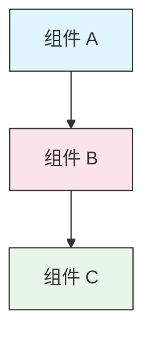

<picture>
  <source media="(prefers-color-scheme: dark)" srcset="resources/logos/claude-howto-logo-dark.svg">
  
</picture>

# 风格指南

> 为 Claude How To 项目贡献内容时的约定和格式规则。遵循本指南以保持内容一致、专业且易于维护。

---

## 目录

- [文件和文件夹命名](#文件和文件夹命名)
- [文档结构](#文档结构)
- [标题](#标题)
- [文本格式](#文本格式)
- [列表](#列表)
- [表格](#表格)
- [代码块](#代码块)
- [链接和交叉引用](#链接和交叉引用)
- [图表](#图表)
- [Emoji 使用规范](#emoji-使用规范)
- [YAML Frontmatter](#yaml-frontmatter)
- [图片和媒体](#图片和媒体)
- [语气和风格](#语气和风格)
- [提交信息](#提交信息)
- [作者检查清单](#作者检查清单)

---

## 文件和文件夹命名

### 课程文件夹

课程文件夹使用**两位数字前缀**加上**kebab-case（短横线连接）**描述符：

```
01-slash-commands/
02-memory/
03-skills/
04-subagents/
05-mcp/
```

数字反映了从入门到高级的学习路径顺序。

### 文件名

| 类型 | 命名约定 | 示例 |
|------|----------|------|
| **课程 README** | `README.md` | `01-slash-commands/README.md` |
| **功能文件** | Kebab-case `.md` | `code-reviewer.md`、`generate-api-docs.md` |
| **Shell 脚本** | Kebab-case `.sh` | `format-code.sh`、`validate-input.sh` |
| **配置文件** | 标准名称 | `.mcp.json`、`settings.json` |
| **记忆文件** | 作用域前缀 | `project-CLAUDE.md`、`personal-CLAUDE.md` |
| **顶层文档** | 大写 `.md` | `CATALOG.md`、`QUICK_REFERENCE.md`、`CONTRIBUTING.md` |
| **图片资源** | Kebab-case | `pr-slash-command.png`、`claude-howto-logo.svg` |

### 规则

- 所有文件和文件夹名称使用**小写**（顶层文档如 `README.md`、`CATALOG.md` 除外）
- 使用**连字符**（`-`）作为单词分隔符，不使用下划线或空格
- 名称应具有描述性但保持简洁

---

## 文档结构

### 根目录 README

根目录 `README.md` 遵循以下顺序：

1. Logo（带深色/浅色模式的 `<picture>` 元素）
2. H1 标题
3. 介绍性引用块（一行价值主张）
4. "为什么选择本指南？"部分及对比表
5. 水平分隔线（`---`）
6. 目录
7. 功能目录
8. 快速导航
9. 学习路径
10. 功能章节
11. 快速开始
12. 最佳实践 / 故障排除
13. 贡献 / 许可证

### 课程 README

每个课程的 `README.md` 遵循以下顺序：

1. H1 标题（例如 `# Slash Commands`）
2. 简要概述段落
3. 快速参考表（可选）
4. 架构图（Mermaid）
5. 详细章节（H2）
6. 实际示例（编号，4-6 个示例）
7. 最佳实践（推荐做法与禁忌表格）
8. 故障排除
9. 相关指南 / 官方文档
10. 文档元数据页脚

### 功能/示例文件

独立的功能文件（例如 `optimize.md`、`pr.md`）：

1. YAML frontmatter（如适用）
2. H1 标题
3. 目的 / 描述
4. 使用说明
5. 代码示例
6. 自定义提示

### 章节分隔符

使用水平分隔线（`---`）分隔文档的主要区域：

```markdown
---

## 新的主要章节
```

将分隔线放在介绍性引用块之后以及文档逻辑上不同的部分之间。

---

## 标题

### 层级结构

| 级别 | 用途 | 示例 |
|------|------|------|
| `#` H1 | 页面标题（每个文档仅一个） | `# Slash Commands` |
| `##` H2 | 主要章节 | `## 最佳实践` |
| `###` H3 | 子章节 | `### 添加 Skill` |
| `####` H4 | 次子章节（少见） | `#### 配置选项` |

### 规则

- **每个文档仅一个 H1** — 仅作为页面标题
- **不跳过层级** — 不要从 H2 直接跳到 H4
- **保持标题简洁** — 目标 2-5 个词
- **使用句子大小写** — 仅首字母和专有名词大写（例外：功能名称保持原样）
- **仅在根目录 README 的章节标题中添加 emoji 前缀**（参见 [Emoji 使用规范](#emoji-使用规范)）

---

## 文本格式

### 强调

| 样式 | 使用时机 | 示例 |
|------|----------|------|
| **粗体**（`**text**`） | 关键术语、表格中的标签、重要概念 | `**安装**：` |
| *斜体*（`*text*`） | 技术术语首次出现、书名/文档标题 | `*frontmatter*` |
| `代码`（`` `text` ``） | 文件名、命令、配置值、代码引用 | `` `CLAUDE.md` `` |

### 引用块用于提示信息

使用带粗体前缀的引用块标注重要信息：

```markdown
> **Note**: 自定义斜杠命令自 v2.0 起已合并到 Skills 中。

> **Important**: 切勿提交 API 密钥或凭据。

> **Tip**: 将记忆与 Skills 结合使用以获得最大效果。
```

支持的提示类型：**Note**、**Important**、**Tip**、**Warning**。

### 段落

- 保持段落简短（2-4 句）
- 段落之间添加空行
- 以要点开头，然后提供上下文
- 解释"为什么"而不仅仅是"是什么"

---

## 列表

### 无序列表

使用短横线（`-`）并以 2 个空格缩进进行嵌套：

```markdown
- 第一项
- 第二项
  - 嵌套项
  - 另一个嵌套项
    - 深层嵌套（避免超过 3 层）
- 第三项
```

### 有序列表

对顺序步骤、操作说明和排名项目使用编号列表：

```markdown
1. 第一步
2. 第二步
   - 子要点详情
   - 另一个子要点
3. 第三步
```

### 描述列表

使用粗体标签来表示键值对样式的列表：

```markdown
- **性能瓶颈** - 识别 O(n^2) 操作、低效循环
- **内存泄漏** - 查找未释放的资源、循环引用
- **算法改进** - 建议更好的算法或数据结构
```

### 规则

- 保持一致的缩进（每级 2 个空格）
- 列表前后添加空行
- 保持列表项结构平行（全部以动词开头，或全部为名词等）
- 避免嵌套超过 3 层

---

## 表格

### 标准格式

```markdown
| 列 1 | 列 2 | 列 3 |
|------|------|------|
| 数据 | 数据 | 数据 |
```

### 常见表格模式

**功能对比（3-4 列）：**

```markdown
| 功能 | 调用方式 | 持久性 | 最适用于 |
|------|----------|--------|----------|
| **Slash Commands** | 手动（`/cmd`） | 仅会话内 | 快捷操作 |
| **Memory** | 自动加载 | 跨会话 | 长期学习 |
```

**推荐做法与禁忌：**

```markdown
| 推荐 | 禁忌 |
|------|------|
| 使用描述性名称 | 使用模糊名称 |
| 保持文件专注 | 在单个文件中放置过多内容 |
```

**快速参考：**

```markdown
| 方面 | 详情 |
|------|------|
| **目的** | 生成 API 文档 |
| **范围** | 项目级别 |
| **复杂度** | 中级 |
```

### 规则

- 当表头用作行标签（第一列）时使用**粗体**
- 为提高源代码可读性，对齐竖线符号（可选但推荐）
- 保持单元格内容简洁；使用链接提供更多详情
- 单元格内的命令和文件路径使用 `代码格式`

---

## 代码块

### 语言标签

始终指定语言标签以启用语法高亮：

| 语言 | 标签 | 用途 |
|------|------|------|
| Shell | `bash` | CLI 命令、脚本 |
| Python | `python` | Python 代码 |
| JavaScript | `javascript` | JS 代码 |
| TypeScript | `typescript` | TS 代码 |
| JSON | `json` | 配置文件 |
| YAML | `yaml` | Frontmatter、配置 |
| Markdown | `markdown` | Markdown 示例 |
| SQL | `sql` | 数据库查询 |
| 纯文本 | （无标签） | 预期输出、目录树 |

### 约定

```bash
# 注释说明命令的功能
claude mcp add notion --transport http https://mcp.notion.com/mcp
```

- 在不明显的命令前添加**注释行**
- 确保所有示例**可以直接复制粘贴**
- 相关时展示**简单版和高级版**
- 当有助于理解时包含**预期输出**（使用无标签代码块）

### 安装代码块

安装说明使用以下模式：

```bash
# 将文件复制到你的项目
cp 01-slash-commands/*.md .claude/commands/
```

### 多步骤工作流

```bash
# 步骤 1：创建目录
mkdir -p .claude/commands

# 步骤 2：复制模板
cp 01-slash-commands/*.md .claude/commands/

# 步骤 3：验证安装
ls .claude/commands/
```

---

## 链接和交叉引用

### 内部链接（相对路径）

所有内部链接使用相对路径：

```markdown
[Slash Commands](01-slash-commands/)
[Skills 指南](03-skills/)
[Memory 架构](02-memory/#memory-architecture)
```

从课程文件夹返回根目录或同级目录：

```markdown
[返回主指南](../README.md)
[相关：Skills](../03-skills/)
```

### 外部链接（绝对路径）

使用完整 URL 和描述性锚文本：

```markdown
[Anthropic 官方文档](https://code.claude.com/docs/en/overview)
```

- 不要使用"点击这里"或"此链接"作为锚文本
- 使用在上下文之外仍有意义的描述性文本

### 章节锚点

使用 GitHub 风格的锚点链接到同一文档中的章节：

```markdown
[功能目录](#-feature-catalog)
[最佳实践](#best-practices)
```

### 相关指南模式

课程以相关指南部分结尾：

```markdown
## 相关指南

- [Slash Commands](../01-slash-commands/) - 快捷操作
- [Memory](../02-memory/) - 持久化上下文
- [Skills](../03-skills/) - 可复用能力
```

---

## 图表

### Mermaid

所有图表使用 Mermaid。支持的类型：

- `graph TB` / `graph LR` — 架构、层级、流程
- `sequenceDiagram` — 交互流程
- `timeline` — 时间序列

### 样式约定

使用 style 块应用一致的颜色：



**颜色方案：**

| 颜色 | 十六进制 | 用途 |
|------|----------|------|
| 浅蓝色 | `#e1f5fe` | 主要组件、输入 |
| 浅粉色 | `#fce4ec` | 处理、中间件 |
| 浅绿色 | `#e8f5e9` | 输出、结果 |
| 浅黄色 | `#fff9c4` | 配置、可选项 |
| 浅紫色 | `#f3e5f5` | 面向用户、UI |

### 规则

- 使用 `["标签文本"]` 作为节点标签（允许特殊字符）
- 使用 `<br/>` 在标签内换行
- 保持图表简洁（最多 10-12 个节点）
- 在图表下方添加简要文字描述以提高可访问性
- 层级结构使用自上而下（`TB`），工作流使用从左到右（`LR`）

---

## Emoji 使用规范

### 使用 Emoji 的场景

Emoji 的使用应**克制且有目的性** — 仅在特定上下文中使用：

| 上下文 | Emoji | 示例 |
|--------|-------|------|
| 根目录 README 章节标题 | 分类图标 | `## 📚 学习路径` |
| 技能水平指示器 | 彩色圆圈 | 🟢 入门、🔵 中级、🔴 高级 |
| 推荐做法与禁忌 | 勾选/叉号 | ✅ 推荐做法、❌ 禁止做法 |
| 复杂度评级 | 星号 | ⭐⭐⭐ |

### 标准 Emoji 集

| Emoji | 含义 |
|-------|------|
| 📚 | 学习、指南、文档 |
| ⚡ | 快速开始、快速参考 |
| 🎯 | 功能、快速参考 |
| 🎓 | 学习路径 |
| 📊 | 统计、对比 |
| 🚀 | 安装、快捷命令 |
| 🟢 | 入门级 |
| 🔵 | 中级 |
| 🔴 | 高级 |
| ✅ | 推荐做法 |
| ❌ | 避免 / 反模式 |
| ⭐ | 复杂度评级单位 |

### 规则

- **不要在正文或段落中使用 emoji**
- **仅在根目录 README 的标题中使用 emoji**（不在课程 README 中使用）
- **不要添加装饰性 emoji** — 每个 emoji 都应传达含义
- 保持 emoji 使用与上表一致

---

## YAML Frontmatter

### 功能文件（Skills、Commands、Agents）

```yaml
---
name: unique-identifier
description: 该功能的用途及使用时机
allowed-tools: Bash, Read, Grep
---
```

### 可选字段

```yaml
---
name: my-feature
description: 简要描述
argument-hint: "[file-path] [options]"
allowed-tools: Bash, Read, Grep, Write, Edit
model: opus                        # opus、sonnet 或 haiku
disable-model-invocation: true     # 仅用户调用
user-invocable: false              # 从用户菜单隐藏
context: fork                      # 在隔离的子代理中运行
agent: Explore                     # context: fork 的代理类型
---
```

### 规则

- 将 frontmatter 放在文件的最顶部
- `name` 字段使用 **kebab-case**
- `description` 保持在一句话以内
- 仅包含需要的字段

---

## 图片和媒体

### Logo 模式

所有以 logo 开头的文档使用 `<picture>` 元素以支持深色/浅色模式：

```html
<picture>
  <source media="(prefers-color-scheme: dark)" srcset="resources/logos/claude-howto-logo-dark.svg">
  
</picture>
```

### 截图

- 存储在相关的课程文件夹中（例如 `01-slash-commands/pr-slash-command.png`）
- 使用 kebab-case 文件名
- 包含描述性 alt 文本
- 图表优先使用 SVG，截图使用 PNG

### 规则

- 始终为图片提供 alt 文本
- 保持图片文件大小合理（PNG 小于 500KB）
- 使用相对路径引用图片
- 将图片存储在引用它的文档所在目录中，或存放在 `assets/` 中用于共享图片

---

## 语气和风格

### 写作风格

- **专业但平易近人** — 技术准确而不堆砌术语
- **主动语态** — "创建一个文件"而非"应创建一个文件"
- **直接指令** — "运行此命令"而非"你可能想运行此命令"
- **对新手友好** — 假设读者是 Claude Code 的新手，但不是编程新手

### 内容原则

| 原则 | 示例 |
|------|------|
| **展示而非讲述** | 提供可运行的示例，而非抽象描述 |
| **渐进式复杂度** | 从简单开始，在后续章节中增加深度 |
| **解释"为什么"** | "使用 Memory 是因为……"而非仅"使用 Memory 来……" |
| **可直接复制粘贴** | 每个代码块粘贴后应可直接运行 |
| **真实场景** | 使用实际场景，而非刻意构造的示例 |

### 用词规范

- 使用"Claude Code"（而非"Claude CLI"或"该工具"）
- 使用"skill"（而非"custom command"——这是旧称）
- 对编号章节使用"课程"或"指南"
- 对独立功能文件使用"示例"

---

## 提交信息

遵循 [Conventional Commits](https://www.conventionalcommits.org/) 规范：

```
type(scope): description
```

### 类型

| 类型 | 用途 |
|------|------|
| `feat` | 新功能、示例或指南 |
| `fix` | 错误修复、更正、失效链接 |
| `docs` | 文档改进 |
| `refactor` | 在不改变行为的情况下重构 |
| `style` | 仅格式更改 |
| `test` | 测试添加或修改 |
| `chore` | 构建、依赖、CI |

### 作用域

使用课程名称或文件区域作为作用域：

```
feat(slash-commands): Add API documentation generator
docs(memory): Improve personal preferences example
fix(README): Correct table of contents link
docs(skills): Add comprehensive code review skill
```

---

## 文档元数据页脚

课程 README 以元数据块结尾：

```markdown
---
**Last Updated**: March 2026
**Claude Code Version**: 2.1.97
**Compatible Models**: Claude Sonnet 4.6, Claude Opus 4.7, Claude Haiku 4.5
```

- 使用月份 + 年份格式（例如"March 2026"）
- 当功能发生变化时更新版本号
- 列出所有兼容的模型

---

## 作者检查清单

提交内容前，请确认：

- [ ] 文件/文件夹名称使用 kebab-case
- [ ] 文档以 H1 标题开头（每个文件仅一个）
- [ ] 标题层级正确（不跳级）
- [ ] 所有代码块都有语言标签
- [ ] 代码示例可直接复制粘贴
- [ ] 内部链接使用相对路径
- [ ] 外部链接有描述性锚文本
- [ ] 表格格式正确
- [ ] Emoji 遵循标准集（如果使用的话）
- [ ] Mermaid 图表使用标准颜色方案
- [ ] 不包含敏感信息（API 密钥、凭据）
- [ ] YAML frontmatter 有效（如适用）
- [ ] 图片有 alt 文本
- [ ] 段落简短且重点突出
- [ ] 相关指南部分链接到相关课程
- [ ] 提交信息遵循 Conventional Commits 格式

---

**Last Updated**: April 24, 2026
**Claude Code Version**: 2.1.119
**Sources**:
- https://code.claude.com/docs/en/overview
- https://code.claude.com/docs/en/changelog
- https://www.anthropic.com/news/claude-opus-4-7
**Compatible Models**: Claude Sonnet 4.6, Claude Opus 4.7, Claude Haiku 4.5
