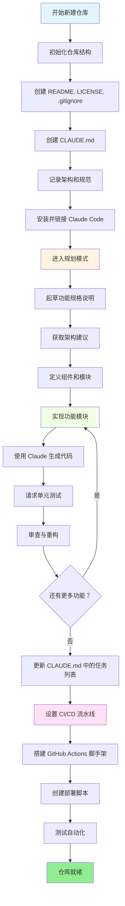
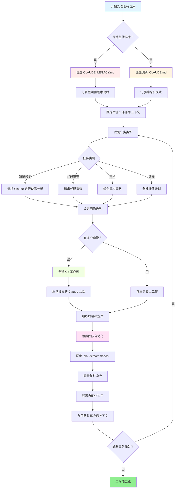

<picture>
  <source media="(prefers-color-scheme: dark)" srcset="resources/logos/claude-howto-logo-dark.svg">
  
</picture>

# 优质资源列表

## 官方文档

| 资源 | 描述 | 链接 |
|------|------|------|
| Claude Code Docs | Claude Code 官方文档 | [code.claude.com/docs/en/overview](https://code.claude.com/docs/en/overview) |
| Anthropic Docs | Anthropic 完整文档 | [docs.anthropic.com](https://docs.anthropic.com) |
| MCP Protocol | Model Context Protocol 规范 | [modelcontextprotocol.io](https://modelcontextprotocol.io) |
| MCP Servers | 官方 MCP 服务器实现 | [github.com/modelcontextprotocol/servers](https://github.com/modelcontextprotocol/servers) |
| Anthropic Cookbook | 代码示例与教程 | [github.com/anthropics/anthropic-cookbook](https://github.com/anthropics/anthropic-cookbook) |
| Claude Code Skills | 社区技能仓库 | [github.com/anthropics/skills](https://github.com/anthropics/skills) |
| Agent Teams | 多智能体协调与协作 | [code.claude.com/docs/en/agent-teams](https://code.claude.com/docs/en/agent-teams) |
| Scheduled Tasks | 使用 /loop 和 cron 执行定期任务 | [code.claude.com/docs/en/scheduled-tasks](https://code.claude.com/docs/en/scheduled-tasks) |
| Chrome Integration | 浏览器自动化 | [code.claude.com/docs/en/chrome](https://code.claude.com/docs/en/chrome) |
| Keybindings | 键盘快捷键自定义 | [code.claude.com/docs/en/keybindings](https://code.claude.com/docs/en/keybindings) |
| Desktop App | 原生桌面应用程序 | [code.claude.com/docs/en/desktop](https://code.claude.com/docs/en/desktop) |
| Remote Control | 远程会话控制 | [code.claude.com/docs/en/remote-control](https://code.claude.com/docs/en/remote-control) |
| Auto Mode | 自动权限管理 | [code.claude.com/docs/en/permissions](https://code.claude.com/docs/en/permissions) |
| Channels | 多通道通信 | [code.claude.com/docs/en/channels](https://code.claude.com/docs/en/channels) |
| Voice Dictation | Claude Code 语音输入 | [code.claude.com/docs/en/voice-dictation](https://code.claude.com/docs/en/voice-dictation) |

## Anthropic 工程博客

| 文章 | 描述 | 链接 |
|------|------|------|
| Code Execution with MCP | 如何通过代码执行解决 MCP 上下文膨胀问题——减少 98.7% 的 token 消耗 | [anthropic.com/engineering/code-execution-with-mcp](https://www.anthropic.com/engineering/code-execution-with-mcp) |

---

## 30 分钟精通 Claude Code

_视频_: https://www.youtube.com/watch?v=6eBSHbLKuN0

_**所有技巧**_
- **探索高级功能和快捷方式**
  - 定期查看 Claude 发布说明中的代码编辑和上下文新功能。
  - 学习键盘快捷键，快速在聊天、文件和编辑器视图之间切换。

- **高效设置**
  - 创建具有清晰名称/描述的项目专属会话，便于后续检索。
  - 固定最常用的文件或文件夹，以便 Claude 随时访问。
  - 设置 Claude 的集成（如 GitHub、常用 IDE），以简化编码流程。

- **高效代码库问答**
  - 向 Claude 询问关于架构、设计模式和特定模块的详细问题。
  - 在提问时使用文件和行号引用（例如，"请解释 `app/models/user.py` 中的逻辑"）。
  - 对于大型代码库，提供摘要或清单以帮助 Claude 聚焦。
  - **示例提示词**: _"你能解释一下 src/auth/AuthService.ts:45-120 中实现的认证流程吗？它是如何与 src/middleware/auth.ts 中的中间件集成的？"_

- **代码编辑与重构**
  - 在代码块中使用行内注释或请求来获得针对性的编辑（"重构这个函数以提高清晰度"）。
  - 要求提供修改前后的对比。
  - 在重大编辑后让 Claude 生成测试或文档以确保质量。
  - **示例提示词**: _"将 api/users.js 中的 getUserData 函数重构为使用 async/await 而非 promises。展示修改前后的对比，并为重构后的版本生成单元测试。"_

- **上下文管理**
  - 将粘贴的代码/上下文限制在当前任务相关的范围内。
  - 使用结构化提示词（"这是文件 A，这是函数 B，我的问题是 X"）以获得最佳效果。
  - 在提示窗口中移除或折叠大文件，以避免超出上下文限制。
  - **示例提示词**: _"这是 models/User.js 中的 User 模型和 utils/validation.js 中的 validateUser 函数。我的问题是：如何在保持向后兼容性的同时添加邮箱验证？"_

- **集成团队工具**
  - 将 Claude 会话连接到团队的代码仓库和文档。
  - 使用内置模板或为常见工程任务创建自定义模板。
  - 通过与队友共享会话记录和提示词来进行协作。

- **提升性能**
  - 给 Claude 清晰的、目标导向的指令（例如，"用五个要点总结这个类"）。
  - 从上下文窗口中删除不必要的注释和样板代码。
  - 如果 Claude 的输出偏离方向，重置上下文或重新措辞以获得更好的对齐。
  - **示例提示词**: _"用五个要点总结 src/db/Manager.ts 中的 DatabaseManager 类，重点关注其主要职责和关键方法。"_

- **实际使用示例**
  - 调试：粘贴错误信息和堆栈跟踪，然后询问可能的原因和修复方法。
  - 测试生成：为复杂逻辑请求基于属性的测试、单元测试或集成测试。
  - 代码审查：要求 Claude 识别风险变更、边界情况或代码异味。
  - **示例提示词**:
    - _"我遇到了这个错误：'TypeError: Cannot read property 'map' of undefined at line 42 in components/UserList.jsx'。以下是堆栈跟踪和相关代码。是什么导致了这个问题，如何修复？"_
    - _"为 PaymentProcessor 类生成全面的单元测试，包括交易失败、超时和无效输入的边界情况。"_
    - _"审查这个 pull request 的 diff，识别潜在的安全问题、性能瓶颈和代码异味。"_

- **工作流自动化**
  - 使用 Claude 提示词编写脚本来处理重复任务（如格式化、清理和批量重命名）。
  - 使用 Claude 根据代码 diff 起草 PR 描述、发布说明或文档。
  - **示例提示词**: _"根据 git diff，创建一个详细的 PR 描述，包含变更摘要、修改文件列表、测试步骤和潜在影响。同时为 2.3.0 版本生成发布说明。"_

**提示**: 为获得最佳效果，请结合使用以上多种实践——先固定关键文件并总结目标，然后使用针对性的提示词和 Claude 的重构工具来逐步改善代码库和自动化流程。

**Claude Code 推荐工作流**

### Claude Code 推荐工作流

#### 新建仓库

1. **初始化仓库和 Claude 集成**
   - 使用基本结构设置新仓库：README、LICENSE、.gitignore、根目录配置文件。
   - 创建 `CLAUDE.md` 文件，描述架构、高层目标和编码规范。
   - 安装 Claude Code 并将其链接到你的仓库，用于代码建议、测试脚手架和工作流自动化。

2. **使用规划模式和规格说明**
   - 使用规划模式（`shift-tab` 或 `/plan`）在实现功能之前起草详细的规格说明。
   - 向 Claude 请求架构建议和初始项目布局。
   - 保持清晰的、目标导向的提示序列——请求组件概要、主要模块和职责划分。

3. **迭代开发与审查**
   - 将核心功能分小块实现，利用 Claude 进行代码生成、重构和文档编写。
   - 每次增量后请求单元测试和示例。
   - 在 CLAUDE.md 中维护一个持续更新的任务列表。

4. **自动化 CI/CD 和部署**
   - 使用 Claude 搭建 GitHub Actions、npm/yarn 脚本或部署工作流的脚手架。
   - 通过更新 CLAUDE.md 并请求相应的命令/脚本来轻松调整流水线。

#### 现有仓库

1. **仓库与上下文设置**
   - 添加或更新 `CLAUDE.md`，记录仓库结构、编码模式和关键文件。对于遗留仓库，使用 `CLAUDE_LEGACY.md` 涵盖框架、版本映射、说明、已知缺陷和升级注意事项。
   - 固定或高亮 Claude 应使用的主要文件作为上下文。

2. **上下文感知的代码问答**
   - 通过引用特定文件/函数，向 Claude 请求代码审查、缺陷解释、重构或迁移计划。
   - 给 Claude 设定明确的边界（例如，"只修改这些文件"或"不添加新依赖"）。

3. **分支、工作树和多会话管理**
   - 使用多个 git 工作树来隔离功能或缺陷修复，并为每个工作树启动独立的 Claude 会话。
   - 按分支或功能组织终端标签页/窗口，实现并行工作流。

4. **团队工具和自动化**
   - 通过 `.claude/commands/` 同步自定义命令，确保跨团队一致性。
   - 通过 Claude 的斜杠命令或钩子自动化重复任务、PR 创建和代码格式化。
   - 与团队成员共享会话和上下文，进行协作排查和审查。

**提示**:
- 每个新功能或修复都以规格说明和规划模式提示开始。
- 对于遗留和复杂仓库，将详细指南存储在 CLAUDE.md/CLAUDE_LEGACY.md 中。
- 给出清晰、聚焦的指令，将复杂工作分解为多阶段计划。
- 定期清理会话、精简上下文、移除已完成的工作树，避免混乱。

以上步骤涵盖了在新建和现有代码库中使用 Claude Code 实现流畅工作流的核心建议。

---

## 新功能和特性（2026 年 3 月）

### 主要功能资源

| 功能 | 描述 | 了解更多 |
|------|------|----------|
| **Auto Memory** | Claude 自动学习并跨会话记住你的偏好 | [记忆指南](02-memory/) |
| **Remote Control** | 从外部工具和脚本以编程方式控制 Claude Code 会话 | [高级功能](09-advanced-features/) |
| **Web Sessions** | 通过基于浏览器的界面访问 Claude Code，用于远程开发 | [CLI 参考](10-cli/) |
| **Desktop App** | Claude Code 原生桌面应用程序，具有增强的用户界面 | [Claude Code Docs](https://code.claude.com/docs/en/desktop) |
| **Extended Thinking** | 通过 `Alt+T`/`Option+T` 或 `MAX_THINKING_TOKENS` 环境变量切换深度推理 | [高级功能](09-advanced-features/) |
| **Permission Modes** | 细粒度控制：default、acceptEdits、plan、auto、dontAsk、bypassPermissions | [高级功能](09-advanced-features/) |
| **7-Tier Memory** | 托管策略、项目、项目规则、用户、用户规则、本地、自动记忆 | [记忆指南](02-memory/) |
| **Hook Events** | 28 种事件：PreToolUse、PostToolUse、PostToolUseFailure、Stop、StopFailure、SubagentStart、SubagentStop、Notification、Elicitation 等 | [钩子指南](06-hooks/) |
| **Agent Teams** | 协调多个智能体协同完成复杂任务 | [子智能体指南](04-subagents/) |
| **Scheduled Tasks** | 使用 `/loop` 和 cron 工具设置定期任务 | [高级功能](09-advanced-features/) |
| **Chrome Integration** | 使用无头 Chromium 进行浏览器自动化 | [高级功能](09-advanced-features/) |
| **Keyboard Customization** | 自定义键绑定，包括组合键序列 | [高级功能](09-advanced-features/) |
| **Monitor Tool** | 监视后台命令的 stdout 流并响应事件，替代轮询方式（v2.1.98+） | [高级功能](09-advanced-features/) |

---
**最后更新**: 2026 年 4 月 24 日
**Claude Code 版本**: 2.1.119
**来源**:
- https://code.claude.com/docs/en/overview
- https://code.claude.com/docs/en/changelog
- https://github.com/anthropics/claude-code/releases/tag/v2.1.119
**兼容模型**: Claude Sonnet 4.6、Claude Opus 4.7、Claude Haiku 4.5
